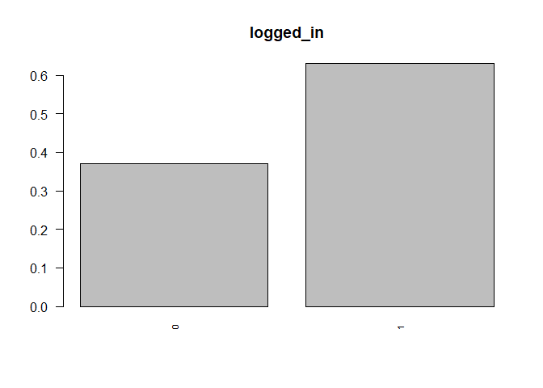
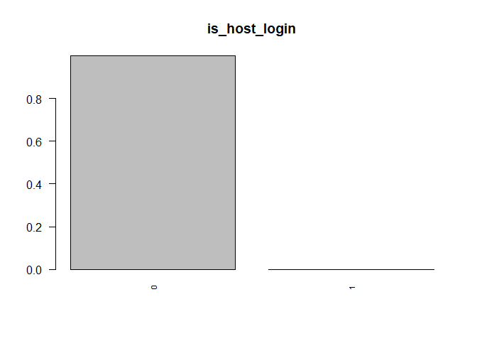
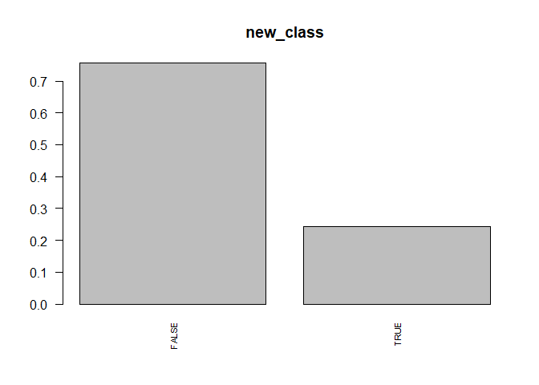

Capstone Project - Julian Pedraza - 500929362
================

# INTRUSION DETECTION CLASSIFICATION MODEL

## 0\. Preparation

install.packages(“FSelector”) install.packages(“FSelectorRcpp”,
dependencies = TRUE) install.packages(“randomForest”)
install.packages(“ROSE”) install.packages(“caret”)
install.packages(“kernlab”) install.packages(‘ggplot2’) \#needed for
ggplot install.packages(‘DAAG’) \#needed for CVbinary

    ## 
    ## Attaching package: 'dplyr'

    ## The following objects are masked from 'package:stats':
    ## 
    ##     filter, lag

    ## The following objects are masked from 'package:base':
    ## 
    ##     intersect, setdiff, setequal, union

    ## Loading required package: lattice

    ## Loading required package: ggplot2

    ## 
    ## Attaching package: 'ggplot2'

    ## The following object is masked from 'package:kernlab':
    ## 
    ##     alpha

    ## Loaded ROSE 0.0-3

    ## randomForest 4.6-14

    ## Type rfNews() to see new features/changes/bug fixes.

    ## 
    ## Attaching package: 'randomForest'

    ## The following object is masked from 'package:ggplot2':
    ## 
    ##     margin

    ## The following object is masked from 'package:dplyr':
    ## 
    ##     combine

## 1\. UNIVARIATE ANALYSIS

### 1.1. Load data

The following dataset is a revised version of the original KDD99 -
Training set, Hive has been used to create a subset that excludes the
duplicated records, additionally, the “new\_class” attribute was created
as the target for the classification
algorithm.

``` r
train_dist_newclass <- read.csv("D:\\0 - Julian\\2 - Ryerson\\136 - Capstone\\1 - Project\\1 - Work\\Data\\1 - Distinct\\train_distinct_newclass.csv", header = F)
```

### 1.2 Include headers as shown in the data dictionary

``` r
train_colnames_newclass <- c("duration", "protocol_type", "service", "flag", "src_bytes", "dst_bytes", "land", "wrong_fragment", "urgent", "hot", "num_failed_logins", "logged_in", "num_compromised", "root_shell", "su_attempted", "num_root", "num_file_creations", "num_shells", "num_access_files", "num_outbound_cmds", "is_host_login", "is_guest_login", "count", "srv_count", "serror_rate", "srv_serror_rate", "rerror_rate", "srv_rerror_rate", "same_srv_rate", "diff_srv_rate", "srv_diff_host_rate", "dst_host_count", "dst_host_srv_count", "dst_host_same_srv_rate", "dst_host_diff_srv_rate", "dst_host_same_src_port_rate", "dst_host_srv_diff_host_rate", "dst_host_serror_rate", "dst_host_srv_serror_rate", "dst_host_rerror_rate", "dst_host_srv_rerror_rate", "class", "new_class")
train_dist_newclass_label<- setNames(train_dist_newclass, train_colnames_newclass)
class(train_colnames_newclass)
```

    ## [1] "character"

### 1.3. Summary

The “new\_class” attribute will consolidate the results in two levels.
The first one “normal” includes the normal connections, while “attack”
includes all non-normal connections. This process will also help balance
the dependent variable a little bit more. (Ratio Normal:Attack = 3.1).
The processing of this new attribute was made using Hive as a
    tool.

``` r
summary(train_dist_newclass)
```

    ##        V1             V2                V3               V4        
    ##  Min.   :    0.0   icmp: 11907   http    :580507   SF     :786840  
    ##  1st Qu.:    0.0   tcp :978540   private :198745   S0     :203565  
    ##  Median :    0.0   udp : 84545   smtp    : 96525   REJ    : 75457  
    ##  Mean   :  134.9                 domain_u: 46730   RSTO   :  5090  
    ##  3rd Qu.:    0.0                 ftp_data: 40426   RSTR   :  2825  
    ##  Max.   :58329.0                 other   : 30924   S1     :   532  
    ##                                  (Other) : 81135   (Other):   683  
    ##        V5                  V6                  V7          
    ##  Min.   :0.000e+00   Min.   :0.000e+00   Min.   :0.00e+00  
    ##  1st Qu.:0.000e+00   1st Qu.:0.000e+00   1st Qu.:0.00e+00  
    ##  Median :2.190e+02   Median :3.320e+02   Median :0.00e+00  
    ##  Mean   :5.838e+03   Mean   :4.874e+03   Mean   :2.42e-05  
    ##  3rd Qu.:3.060e+02   3rd Qu.:1.721e+03   3rd Qu.:0.00e+00  
    ##  Max.   :1.380e+09   Max.   :1.310e+09   Max.   :1.00e+00  
    ##                                                            
    ##        V8                 V9               V10          
    ##  Min.   :0.000000   Min.   :0.0e+00   Min.   : 0.00000  
    ##  1st Qu.:0.000000   1st Qu.:0.0e+00   1st Qu.: 0.00000  
    ##  Median :0.000000   Median :0.0e+00   Median : 0.00000  
    ##  Mean   :0.002736   Mean   :3.6e-05   Mean   : 0.05428  
    ##  3rd Qu.:0.000000   3rd Qu.:0.0e+00   3rd Qu.: 0.00000  
    ##  Max.   :3.000000   Max.   :1.4e+01   Max.   :77.00000  
    ##                                                         
    ##       V11                V12              V13          
    ##  Min.   :0.000000   Min.   :0.0000   Min.   :   0.000  
    ##  1st Qu.:0.000000   1st Qu.:0.0000   1st Qu.:   0.000  
    ##  Median :0.000000   Median :1.0000   Median :   0.000  
    ##  Mean   :0.000146   Mean   :0.6301   Mean   :   0.036  
    ##  3rd Qu.:0.000000   3rd Qu.:1.0000   3rd Qu.:   0.000  
    ##  Max.   :5.000000   Max.   :1.0000   Max.   :7479.000  
    ##                                                        
    ##       V14                 V15                 V16          
    ##  Min.   :0.0000000   Min.   :0.0000000   Min.   :   0.000  
    ##  1st Qu.:0.0000000   1st Qu.:0.0000000   1st Qu.:   0.000  
    ##  Median :0.0000000   Median :0.0000000   Median :   0.000  
    ##  Mean   :0.0003023   Mean   :0.0001674   Mean   :   0.059  
    ##  3rd Qu.:0.0000000   3rd Qu.:0.0000000   3rd Qu.:   0.000  
    ##  Max.   :1.0000000   Max.   :2.0000000   Max.   :7468.000  
    ##                                                            
    ##       V17                V18                 V19               V20   
    ##  Min.   : 0.00000   Min.   :0.0000000   Min.   :0.00000   Min.   :0  
    ##  1st Qu.: 0.00000   1st Qu.:0.0000000   1st Qu.:0.00000   1st Qu.:0  
    ##  Median : 0.00000   Median :0.0000000   Median :0.00000   Median :0  
    ##  Mean   : 0.00542   Mean   :0.0003386   Mean   :0.00432   Mean   :0  
    ##  3rd Qu.: 0.00000   3rd Qu.:0.0000000   3rd Qu.:0.00000   3rd Qu.:0  
    ##  Max.   :43.00000   Max.   :2.0000000   Max.   :9.00000   Max.   :0  
    ##                                                                      
    ##       V21               V22                V23              V24        
    ##  Min.   :0.0e+00   Min.   :0.000000   Min.   :  0.00   Min.   :  0.00  
    ##  1st Qu.:0.0e+00   1st Qu.:0.000000   1st Qu.:  2.00   1st Qu.:  2.00  
    ##  Median :0.0e+00   Median :0.000000   Median :  8.00   Median :  7.00  
    ##  Mean   :1.9e-06   Mean   :0.003803   Mean   : 49.35   Mean   : 12.98  
    ##  3rd Qu.:0.0e+00   3rd Qu.:0.000000   3rd Qu.: 34.00   3rd Qu.: 15.00  
    ##  Max.   :1.0e+00   Max.   :1.000000   Max.   :511.00   Max.   :511.00  
    ##                                                                        
    ##       V25              V26              V27               V28         
    ##  Min.   :0.0000   Min.   :0.0000   Min.   :0.00000   Min.   :0.00000  
    ##  1st Qu.:0.0000   1st Qu.:0.0000   1st Qu.:0.00000   1st Qu.:0.00000  
    ##  Median :0.0000   Median :0.0000   Median :0.00000   Median :0.00000  
    ##  Mean   :0.1901   Mean   :0.1908   Mean   :0.07812   Mean   :0.07793  
    ##  3rd Qu.:0.0000   3rd Qu.:0.0000   3rd Qu.:0.00000   3rd Qu.:0.00000  
    ##  Max.   :1.0000   Max.   :1.0000   Max.   :1.00000   Max.   :1.00000  
    ##                                                                       
    ##       V29              V30              V31              V32     
    ##  Min.   :0.0000   Min.   :0.0000   Min.   :0.0000   Min.   :  0  
    ##  1st Qu.:1.0000   1st Qu.:0.0000   1st Qu.:0.0000   1st Qu.: 50  
    ##  Median :1.0000   Median :0.0000   Median :0.0000   Median :224  
    ##  Mean   :0.7786   Mean   :0.0316   Mean   :0.1179   Mean   :162  
    ##  3rd Qu.:1.0000   3rd Qu.:0.0100   3rd Qu.:0.0900   3rd Qu.:255  
    ##  Max.   :1.0000   Max.   :1.0000   Max.   :1.0000   Max.   :255  
    ##                                                                  
    ##       V33             V34              V35              V36         
    ##  Min.   :  0.0   Min.   :0.0000   Min.   :0.0000   Min.   :0.00000  
    ##  1st Qu.: 18.0   1st Qu.:0.0700   1st Qu.:0.0000   1st Qu.:0.00000  
    ##  Median :248.0   Median :1.0000   Median :0.0000   Median :0.01000  
    ##  Mean   :159.2   Mean   :0.6701   Mean   :0.0495   Mean   :0.09336  
    ##  3rd Qu.:255.0   3rd Qu.:1.0000   3rd Qu.:0.0600   3rd Qu.:0.04000  
    ##  Max.   :255.0   Max.   :1.0000   Max.   :1.0000   Max.   :1.00000  
    ##                                                                     
    ##       V37               V38              V39              V40         
    ##  Min.   :0.00000   Min.   :0.0000   Min.   :0.0000   Min.   :0.00000  
    ##  1st Qu.:0.00000   1st Qu.:0.0000   1st Qu.:0.0000   1st Qu.:0.00000  
    ##  Median :0.00000   Median :0.0000   Median :0.0000   Median :0.00000  
    ##  Mean   :0.02174   Mean   :0.1907   Mean   :0.1901   Mean   :0.07954  
    ##  3rd Qu.:0.02000   3rd Qu.:0.0000   3rd Qu.:0.0000   3rd Qu.:0.00000  
    ##  Max.   :1.00000   Max.   :1.0000   Max.   :1.0000   Max.   :1.00000  
    ##                                                                       
    ##       V41                 V42              V43        
    ##  Min.   :0.0000   normal.   :812814   Min.   :0.0000  
    ##  1st Qu.:0.0000   neptune.  :242149   1st Qu.:0.0000  
    ##  Median :0.0000   satan.    :  5019   Median :0.0000  
    ##  Mean   :0.0783   ipsweep.  :  3723   Mean   :0.2439  
    ##  3rd Qu.:0.0000   portsweep.:  3564   3rd Qu.:0.0000  
    ##  Max.   :1.0000   smurf.    :  3007   Max.   :1.0000  
    ##                   (Other)   :  4716

### 1.4. Structure of database

#### 1.4.1. Variable type (Original definition)

``` r
str(train_dist_newclass_label)
```

    ## 'data.frame':    1074992 obs. of  43 variables:
    ##  $ duration                   : int  0 0 0 0 0 0 0 0 0 0 ...
    ##  $ protocol_type              : Factor w/ 3 levels "icmp","tcp","udp": 1 1 1 1 1 1 1 1 1 1 ...
    ##  $ service                    : Factor w/ 70 levels "aol","auth","bgp",..: 12 12 12 12 12 12 12 12 12 12 ...
    ##  $ flag                       : Factor w/ 11 levels "OTH","REJ","RSTO",..: 10 10 10 10 10 10 10 10 10 10 ...
    ##  $ src_bytes                  : int  18 18 18 18 18 18 18 18 18 18 ...
    ##  $ dst_bytes                  : int  0 0 0 0 0 0 0 0 0 0 ...
    ##  $ land                       : int  0 0 0 0 0 0 0 0 0 0 ...
    ##  $ wrong_fragment             : int  0 0 0 0 0 0 0 0 0 0 ...
    ##  $ urgent                     : int  0 0 0 0 0 0 0 0 0 0 ...
    ##  $ hot                        : int  0 0 0 0 0 0 0 0 0 0 ...
    ##  $ num_failed_logins          : int  0 0 0 0 0 0 0 0 0 0 ...
    ##  $ logged_in                  : int  0 0 0 0 0 0 0 0 0 0 ...
    ##  $ num_compromised            : int  0 0 0 0 0 0 0 0 0 0 ...
    ##  $ root_shell                 : int  0 0 0 0 0 0 0 0 0 0 ...
    ##  $ su_attempted               : int  0 0 0 0 0 0 0 0 0 0 ...
    ##  $ num_root                   : int  0 0 0 0 0 0 0 0 0 0 ...
    ##  $ num_file_creations         : int  0 0 0 0 0 0 0 0 0 0 ...
    ##  $ num_shells                 : int  0 0 0 0 0 0 0 0 0 0 ...
    ##  $ num_access_files           : int  0 0 0 0 0 0 0 0 0 0 ...
    ##  $ num_outbound_cmds          : int  0 0 0 0 0 0 0 0 0 0 ...
    ##  $ is_host_login              : int  0 0 0 0 0 0 0 0 0 0 ...
    ##  $ is_guest_login             : int  0 0 0 0 0 0 0 0 0 0 ...
    ##  $ count                      : int  1 1 1 1 1 1 1 1 1 1 ...
    ##  $ srv_count                  : int  1 1 1 1 1 1 1 1 1 1 ...
    ##  $ serror_rate                : num  0 0 0 0 0 0 0 0 0 0 ...
    ##  $ srv_serror_rate            : num  0 0 0 0 0 0 0 0 0 0 ...
    ##  $ rerror_rate                : num  0 0 0 0 0 0 0 0 0 0 ...
    ##  $ srv_rerror_rate            : num  0 0 0 0 0 0 0 0 0 0 ...
    ##  $ same_srv_rate              : num  1 1 1 1 1 1 1 1 1 1 ...
    ##  $ diff_srv_rate              : num  0 0 0 0 0 0 0 0 0 0 ...
    ##  $ srv_diff_host_rate         : num  0 0 0 0 0 0 0 0 0 0 ...
    ##  $ dst_host_count             : int  1 1 1 1 1 1 1 1 1 1 ...
    ##  $ dst_host_srv_count         : int  12 127 133 136 138 153 17 179 19 190 ...
    ##  $ dst_host_same_srv_rate     : num  1 1 1 1 1 1 1 1 1 1 ...
    ##  $ dst_host_diff_srv_rate     : num  0 0 0 0 0 0 0 0 0 0 ...
    ##  $ dst_host_same_src_port_rate: num  1 1 1 1 1 1 1 1 1 1 ...
    ##  $ dst_host_srv_diff_host_rate: num  1 1 0.26 1 1 0.25 1 1 1 1 ...
    ##  $ dst_host_serror_rate       : num  0 0 0 0 0 0 0 0 0 0 ...
    ##  $ dst_host_srv_serror_rate   : num  0 0 0 0 0 0 0 0 0 0 ...
    ##  $ dst_host_rerror_rate       : num  0 0 0 0 0 0 0 0 0 0 ...
    ##  $ dst_host_srv_rerror_rate   : num  0 0 0 0 0 0 0 0 0 0 ...
    ##  $ class                      : Factor w/ 23 levels "back.","buffer_overflow.",..: 6 6 6 6 6 6 6 6 6 6 ...
    ##  $ new_class                  : int  1 1 1 1 1 1 1 1 1 1 ...

#### 1.4.2. Various attributes have to be assigned as factors

``` r
train_dist_newclass_label$land <- as.factor((train_dist_newclass_label$land))
train_dist_newclass_label$logged_in <- as.factor((train_dist_newclass_label$logged_in))
train_dist_newclass_label$root_shell <- as.factor((train_dist_newclass_label$root_shell))
train_dist_newclass_label$su_attempted <- as.factor((train_dist_newclass_label$su_attempted))
train_dist_newclass_label$is_host_login <- as.factor((train_dist_newclass_label$is_host_login))
train_dist_newclass_label$is_guest_login <- as.factor((train_dist_newclass_label$is_guest_login))
```

#### 1.4.3.Change “new\_class” attribute to logical

The class attribute for initial analisis is required to be logical, in
further analysis the data type will change back to
factor

``` r
train_dist_newclass_label$new_class <- as.logical(train_dist_newclass_label$new_class)
```

#### 1.4.4. Confirmation of new data structure

``` r
str(train_dist_newclass_label)
```

    ## 'data.frame':    1074992 obs. of  43 variables:
    ##  $ duration                   : int  0 0 0 0 0 0 0 0 0 0 ...
    ##  $ protocol_type              : Factor w/ 3 levels "icmp","tcp","udp": 1 1 1 1 1 1 1 1 1 1 ...
    ##  $ service                    : Factor w/ 70 levels "aol","auth","bgp",..: 12 12 12 12 12 12 12 12 12 12 ...
    ##  $ flag                       : Factor w/ 11 levels "OTH","REJ","RSTO",..: 10 10 10 10 10 10 10 10 10 10 ...
    ##  $ src_bytes                  : int  18 18 18 18 18 18 18 18 18 18 ...
    ##  $ dst_bytes                  : int  0 0 0 0 0 0 0 0 0 0 ...
    ##  $ land                       : Factor w/ 2 levels "0","1": 1 1 1 1 1 1 1 1 1 1 ...
    ##  $ wrong_fragment             : int  0 0 0 0 0 0 0 0 0 0 ...
    ##  $ urgent                     : int  0 0 0 0 0 0 0 0 0 0 ...
    ##  $ hot                        : int  0 0 0 0 0 0 0 0 0 0 ...
    ##  $ num_failed_logins          : int  0 0 0 0 0 0 0 0 0 0 ...
    ##  $ logged_in                  : Factor w/ 2 levels "0","1": 1 1 1 1 1 1 1 1 1 1 ...
    ##  $ num_compromised            : int  0 0 0 0 0 0 0 0 0 0 ...
    ##  $ root_shell                 : Factor w/ 2 levels "0","1": 1 1 1 1 1 1 1 1 1 1 ...
    ##  $ su_attempted               : Factor w/ 3 levels "0","1","2": 1 1 1 1 1 1 1 1 1 1 ...
    ##  $ num_root                   : int  0 0 0 0 0 0 0 0 0 0 ...
    ##  $ num_file_creations         : int  0 0 0 0 0 0 0 0 0 0 ...
    ##  $ num_shells                 : int  0 0 0 0 0 0 0 0 0 0 ...
    ##  $ num_access_files           : int  0 0 0 0 0 0 0 0 0 0 ...
    ##  $ num_outbound_cmds          : int  0 0 0 0 0 0 0 0 0 0 ...
    ##  $ is_host_login              : Factor w/ 2 levels "0","1": 1 1 1 1 1 1 1 1 1 1 ...
    ##  $ is_guest_login             : Factor w/ 2 levels "0","1": 1 1 1 1 1 1 1 1 1 1 ...
    ##  $ count                      : int  1 1 1 1 1 1 1 1 1 1 ...
    ##  $ srv_count                  : int  1 1 1 1 1 1 1 1 1 1 ...
    ##  $ serror_rate                : num  0 0 0 0 0 0 0 0 0 0 ...
    ##  $ srv_serror_rate            : num  0 0 0 0 0 0 0 0 0 0 ...
    ##  $ rerror_rate                : num  0 0 0 0 0 0 0 0 0 0 ...
    ##  $ srv_rerror_rate            : num  0 0 0 0 0 0 0 0 0 0 ...
    ##  $ same_srv_rate              : num  1 1 1 1 1 1 1 1 1 1 ...
    ##  $ diff_srv_rate              : num  0 0 0 0 0 0 0 0 0 0 ...
    ##  $ srv_diff_host_rate         : num  0 0 0 0 0 0 0 0 0 0 ...
    ##  $ dst_host_count             : int  1 1 1 1 1 1 1 1 1 1 ...
    ##  $ dst_host_srv_count         : int  12 127 133 136 138 153 17 179 19 190 ...
    ##  $ dst_host_same_srv_rate     : num  1 1 1 1 1 1 1 1 1 1 ...
    ##  $ dst_host_diff_srv_rate     : num  0 0 0 0 0 0 0 0 0 0 ...
    ##  $ dst_host_same_src_port_rate: num  1 1 1 1 1 1 1 1 1 1 ...
    ##  $ dst_host_srv_diff_host_rate: num  1 1 0.26 1 1 0.25 1 1 1 1 ...
    ##  $ dst_host_serror_rate       : num  0 0 0 0 0 0 0 0 0 0 ...
    ##  $ dst_host_srv_serror_rate   : num  0 0 0 0 0 0 0 0 0 0 ...
    ##  $ dst_host_rerror_rate       : num  0 0 0 0 0 0 0 0 0 0 ...
    ##  $ dst_host_srv_rerror_rate   : num  0 0 0 0 0 0 0 0 0 0 ...
    ##  $ class                      : Factor w/ 23 levels "back.","buffer_overflow.",..: 6 6 6 6 6 6 6 6 6 6 ...
    ##  $ new_class                  : logi  TRUE TRUE TRUE TRUE TRUE TRUE ...

### 1.5. Summary of dataset

``` r
summary(train_dist_newclass_label)
```

    ##     duration       protocol_type     service            flag       
    ##  Min.   :    0.0   icmp: 11907   http    :580507   SF     :786840  
    ##  1st Qu.:    0.0   tcp :978540   private :198745   S0     :203565  
    ##  Median :    0.0   udp : 84545   smtp    : 96525   REJ    : 75457  
    ##  Mean   :  134.9                 domain_u: 46730   RSTO   :  5090  
    ##  3rd Qu.:    0.0                 ftp_data: 40426   RSTR   :  2825  
    ##  Max.   :58329.0                 other   : 30924   S1     :   532  
    ##                                  (Other) : 81135   (Other):   683  
    ##    src_bytes           dst_bytes         land        wrong_fragment    
    ##  Min.   :0.000e+00   Min.   :0.000e+00   0:1074966   Min.   :0.000000  
    ##  1st Qu.:0.000e+00   1st Qu.:0.000e+00   1:     26   1st Qu.:0.000000  
    ##  Median :2.190e+02   Median :3.320e+02               Median :0.000000  
    ##  Mean   :5.838e+03   Mean   :4.874e+03               Mean   :0.002736  
    ##  3rd Qu.:3.060e+02   3rd Qu.:1.721e+03               3rd Qu.:0.000000  
    ##  Max.   :1.380e+09   Max.   :1.310e+09               Max.   :3.000000  
    ##                                                                        
    ##      urgent             hot           num_failed_logins  logged_in 
    ##  Min.   :0.0e+00   Min.   : 0.00000   Min.   :0.000000   0:397622  
    ##  1st Qu.:0.0e+00   1st Qu.: 0.00000   1st Qu.:0.000000   1:677370  
    ##  Median :0.0e+00   Median : 0.00000   Median :0.000000             
    ##  Mean   :3.6e-05   Mean   : 0.05428   Mean   :0.000146             
    ##  3rd Qu.:0.0e+00   3rd Qu.: 0.00000   3rd Qu.:0.000000             
    ##  Max.   :1.4e+01   Max.   :77.00000   Max.   :5.000000             
    ##                                                                    
    ##  num_compromised    root_shell  su_attempted    num_root       
    ##  Min.   :   0.000   0:1074667   0:1074882    Min.   :   0.000  
    ##  1st Qu.:   0.000   1:    325   1:     40    1st Qu.:   0.000  
    ##  Median :   0.000               2:     70    Median :   0.000  
    ##  Mean   :   0.036                            Mean   :   0.059  
    ##  3rd Qu.:   0.000                            3rd Qu.:   0.000  
    ##  Max.   :7479.000                            Max.   :7468.000  
    ##                                                                
    ##  num_file_creations   num_shells        num_access_files 
    ##  Min.   : 0.00000   Min.   :0.0000000   Min.   :0.00000  
    ##  1st Qu.: 0.00000   1st Qu.:0.0000000   1st Qu.:0.00000  
    ##  Median : 0.00000   Median :0.0000000   Median :0.00000  
    ##  Mean   : 0.00542   Mean   :0.0003386   Mean   :0.00432  
    ##  3rd Qu.: 0.00000   3rd Qu.:0.0000000   3rd Qu.:0.00000  
    ##  Max.   :43.00000   Max.   :2.0000000   Max.   :9.00000  
    ##                                                          
    ##  num_outbound_cmds is_host_login is_guest_login     count       
    ##  Min.   :0         0:1074990     0:1070904      Min.   :  0.00  
    ##  1st Qu.:0         1:      2     1:   4088      1st Qu.:  2.00  
    ##  Median :0                                      Median :  8.00  
    ##  Mean   :0                                      Mean   : 49.35  
    ##  3rd Qu.:0                                      3rd Qu.: 34.00  
    ##  Max.   :0                                      Max.   :511.00  
    ##                                                                 
    ##    srv_count       serror_rate     srv_serror_rate   rerror_rate     
    ##  Min.   :  0.00   Min.   :0.0000   Min.   :0.0000   Min.   :0.00000  
    ##  1st Qu.:  2.00   1st Qu.:0.0000   1st Qu.:0.0000   1st Qu.:0.00000  
    ##  Median :  7.00   Median :0.0000   Median :0.0000   Median :0.00000  
    ##  Mean   : 12.98   Mean   :0.1901   Mean   :0.1908   Mean   :0.07812  
    ##  3rd Qu.: 15.00   3rd Qu.:0.0000   3rd Qu.:0.0000   3rd Qu.:0.00000  
    ##  Max.   :511.00   Max.   :1.0000   Max.   :1.0000   Max.   :1.00000  
    ##                                                                      
    ##  srv_rerror_rate   same_srv_rate    diff_srv_rate    srv_diff_host_rate
    ##  Min.   :0.00000   Min.   :0.0000   Min.   :0.0000   Min.   :0.0000    
    ##  1st Qu.:0.00000   1st Qu.:1.0000   1st Qu.:0.0000   1st Qu.:0.0000    
    ##  Median :0.00000   Median :1.0000   Median :0.0000   Median :0.0000    
    ##  Mean   :0.07793   Mean   :0.7786   Mean   :0.0316   Mean   :0.1179    
    ##  3rd Qu.:0.00000   3rd Qu.:1.0000   3rd Qu.:0.0100   3rd Qu.:0.0900    
    ##  Max.   :1.00000   Max.   :1.0000   Max.   :1.0000   Max.   :1.0000    
    ##                                                                        
    ##  dst_host_count dst_host_srv_count dst_host_same_srv_rate
    ##  Min.   :  0    Min.   :  0.0      Min.   :0.0000        
    ##  1st Qu.: 50    1st Qu.: 18.0      1st Qu.:0.0700        
    ##  Median :224    Median :248.0      Median :1.0000        
    ##  Mean   :162    Mean   :159.2      Mean   :0.6701        
    ##  3rd Qu.:255    3rd Qu.:255.0      3rd Qu.:1.0000        
    ##  Max.   :255    Max.   :255.0      Max.   :1.0000        
    ##                                                          
    ##  dst_host_diff_srv_rate dst_host_same_src_port_rate
    ##  Min.   :0.0000         Min.   :0.00000            
    ##  1st Qu.:0.0000         1st Qu.:0.00000            
    ##  Median :0.0000         Median :0.01000            
    ##  Mean   :0.0495         Mean   :0.09336            
    ##  3rd Qu.:0.0600         3rd Qu.:0.04000            
    ##  Max.   :1.0000         Max.   :1.00000            
    ##                                                    
    ##  dst_host_srv_diff_host_rate dst_host_serror_rate dst_host_srv_serror_rate
    ##  Min.   :0.00000             Min.   :0.0000       Min.   :0.0000          
    ##  1st Qu.:0.00000             1st Qu.:0.0000       1st Qu.:0.0000          
    ##  Median :0.00000             Median :0.0000       Median :0.0000          
    ##  Mean   :0.02174             Mean   :0.1907       Mean   :0.1901          
    ##  3rd Qu.:0.02000             3rd Qu.:0.0000       3rd Qu.:0.0000          
    ##  Max.   :1.00000             Max.   :1.0000       Max.   :1.0000          
    ##                                                                           
    ##  dst_host_rerror_rate dst_host_srv_rerror_rate        class       
    ##  Min.   :0.00000      Min.   :0.0000           normal.   :812814  
    ##  1st Qu.:0.00000      1st Qu.:0.0000           neptune.  :242149  
    ##  Median :0.00000      Median :0.0000           satan.    :  5019  
    ##  Mean   :0.07954      Mean   :0.0783           ipsweep.  :  3723  
    ##  3rd Qu.:0.00000      3rd Qu.:0.0000           portsweep.:  3564  
    ##  Max.   :1.00000      Max.   :1.0000           smurf.    :  3007  
    ##                                                (Other)   :  4716  
    ##  new_class      
    ##  Mode :logical  
    ##  FALSE:812814   
    ##  TRUE :262178   
    ##                 
    ##                 
    ##                 
    ## 

### 1.6. Analysis of Numeric Attributes

#### 1.6.1. Histogram (2x2)

``` r
par(mfrow = c (2,2))
sapply(names(train_dist_newclass_label), function(cname){
  if(is.numeric(train_dist_newclass_label[[cname]]))
    print(hist(train_dist_newclass_label[[cname]], main = cname))
})
```

<!-- --><!-- --><!-- --><!-- --><!-- --><!-- --><!-- --><!-- -->

Comments about histograms:

  - For most of the attributes, the normality test is not required, the
    histogram reflects that they are not following a theoretical normal
    distribution.
  - When analyzing the data distribution for numerical attributes, it is
    easy to confirm that for most of them, data is lying in value zero
    (0)  
  - For the attributes labeded as rate, data lies mostly in the values
    zero (0) and one (1).

#### 1.6.2. Blox Plot

``` r
par(mfrow = c (2,2))
sapply(names(train_dist_newclass_label), function(cname){
  if(is.numeric(train_dist_newclass_label[[cname]]))
    print(boxplot(train_dist_newclass_label[[cname]], main = cname))
})
```

<!-- --><!-- --><!-- --><!-- --><!-- --><!-- --><!-- --><!-- -->

Comments about box plots:

  - As seen in the histogram, for most of the attributes, data is mainly
    concentrated in zero (0) value.
  - Mean, median, and quartiles are not divisible, all of them are shown
    very close to where the data is concentrated
  - For attributes as dst\_bytes and wrong fragment, there are noticeble
    data points, that could be evaluated as outliers. Further analysis
    will demonstrate if they are, and if they could be removed.

#### 1.6.3. Outliers (Initial Analysis)

As most of the data is concentrated in value zero (0), the outliers will
be most of the data that is different than 0.

One good example that represents this approach is the attribute
dst\_bytes. As shown below, Outvals contains 139112 observations that
are considered outliers.

``` r
dst_bytes_range <- range(train_dist_newclass_label$dst_bytes)
dst_bytes_range
```

    ## [1]          0 1309937401

``` r
dst_bytes_out <- boxplot(train_dist_newclass_label$dst_bytes, plot=FALSE)$out
range(dst_bytes_out) #range of outliers for dst_bytes_out
```

    ## [1]       4303 1309937401

Arbitrarly 3 breaks were created based on the range of the data to
identify were the “real” outliers are located for dst\_bytes attribute.
The result shows that most of them are less than 400K.

``` r
break_out <- c(4000, 400000, 40000000, 4000000000)
a_cut <- cut(dst_bytes_out, break_out, right = F)
a_freq <- as.matrix(table(a_cut))
rownames(a_freq) <- c("4K - 400K", "400K - 40M", "40M - 4000M")
colnames(a_freq) <- c("Outlier Freq Dist(dst_bytes)")
a_freq
```

    ##             Outlier Freq Dist(dst_bytes)
    ## 4K - 400K                         138683
    ## 400K - 40M                           426
    ## 40M - 4000M                            3

The next step will be to identify which of the actual outliers can be
dropped or modified from the analysis.

#### 1.6.4. Outliers processing

##### 1.6.4.1. Attribute “Duration”

``` r
dur_range <- range(train_dist_newclass_label$duration)
dur_range
```

    ## [1]     0 58329

``` r
dur_out <- boxplot(train_dist_newclass_label$duration, plot=FALSE)$out
range(dur_out) #range of outliers for dst_bytes_out
```

    ## [1]     1 58329

As with the other variables, given the majority of data as value “0”,
everything different than that, is being considered
outlier.

``` r
dur1 <- subset(train_dist_newclass_label[(train_dist_newclass_label$duration != 0),], select = c("duration","new_class")) #based on outlier threshold
hist(dur1$duration)
```

<!-- -->

``` r
print(barplot(prop.table(table(dur1$new_class)), main = "proportion duration / class", las = 2, cex.names = 0.7))
```

<!-- -->

    ##      [,1]
    ## [1,]  0.7
    ## [2,]  1.9

``` r
dur_break <- c(1, 10, 100, 1000, 10000, 45000, 60000)
dur_cut <- cut(dur1$duration, dur_break, right = F)
dur_freq <- as.matrix(table(dur_cut))
rownames(dur_freq) <- c("1 - 10","10 - 100","100 - 1k", "1k - 10k", "10K - 45k", "45k - 60k")
colnames(dur_freq) <- c("Outlier Freq Dist(duration)")
dur_freq
```

    ##           Outlier Freq Dist(duration)
    ## 1 - 10                          47865
    ## 10 - 100                        14108
    ## 100 - 1k                         4582
    ## 1k - 10k                        17462
    ## 10K - 45k                        4112
    ## 45k - 60k                           1

``` r
#the extreme outlier in this data set is duration 58329 and its class value is "normal", being that class attribute, this data record can be deleted

train_label_1<- subset(train_dist_newclass_label, train_dist_newclass_label[,"duration"] < 45000) #outlier deleted
```

##### 1.6.4.2. Attribute “Hot”

``` r
#the extreme outlier in this data set is hot < 44 and its class is "normal", that can be deleted due to the imbalance of the class attribute

train_label_2 <- subset(train_label_1, train_label_1[,"hot"] < 44) #outlier deleted
```

##### 1.6.4.3. Attribute “num\_root”

``` r
#the extreme outlier in this data set is num_root < 1743 and its class is "normal", that can be deleted due to the imbalance of the class attribute

train_label_3 <- subset(train_label_2, train_label_2[,"num_root"] < 1743) #outlier deleted
```

##### 1.6.4.4. Other attributes with outliers

src-bytes: Couldn’t delete outliers because their class attribute value
is TRUE and its deletition could affect the representation of this class
as part of the model dst-bytes: Couldn’t delete outliers because their
class attribute value is TRUE and its deletition could affect the
representation of this class as part of the
model

### 1.7. Analysis of non-numeric attributes

#### 1.7.1. Barplot (Frequency Distribution)

<!-- --><!-- --><!-- --><!-- --><!-- --><!-- --><!-- --><!-- --><!-- --><!-- --><!-- -->

### 1.8. All Attributes (numeric and non-numeric)

#### 1.8.1. Near Zero Variance

The analysis of near zero variance will be useful during Dimensionality
reduction process, there are various attributes that are considered Near
to Zero Variance that potentially won’t contribute significantly to the
classification algorithm

``` r
train_NZV <- nearZeroVar(train_label_3, saveMetrics = T)
NZV_attribute <- rownames(train_NZV)
NZV_true <- cbind(NZV_attribute,train_NZV) %>% filter(nzv == T)
NZV_true
```

    ##         NZV_attribute    freqRatio percentUnique zeroVar  nzv
    ## 1            duration     42.62714  9.190817e-01   FALSE TRUE
    ## 2           src_bytes     22.40271  6.691250e-01   FALSE TRUE
    ## 3                land  41344.61538  1.860489e-04   FALSE TRUE
    ## 4      wrong_fragment   1180.07143  2.790734e-04   FALSE TRUE
    ## 5              urgent 119441.11111  5.581468e-04   FALSE TRUE
    ## 6                 hot    757.47092  2.604685e-03   FALSE TRUE
    ## 7   num_failed_logins  10045.42991  5.581468e-04   FALSE TRUE
    ## 8     num_compromised    945.67841  8.930349e-03   FALSE TRUE
    ## 9          root_shell   3316.85802  1.860489e-04   FALSE TRUE
    ## 10       su_attempted  15577.92754  2.790734e-04   FALSE TRUE
    ## 11           num_root    445.17902  8.465227e-03   FALSE TRUE
    ## 12 num_file_creations    598.57031  3.907028e-03   FALSE TRUE
    ## 13         num_shells   3035.66949  2.790734e-04   FALSE TRUE
    ## 14   num_access_files    263.00197  9.302447e-04   FALSE TRUE
    ## 15  num_outbound_cmds      0.00000  9.302447e-05    TRUE TRUE
    ## 16      is_host_login 537492.00000  1.860489e-04   FALSE TRUE
    ## 17     is_guest_login    261.96135  1.860489e-04   FALSE TRUE
    ## 18      same_srv_rate     34.94487  9.395471e-03   FALSE TRUE
    ## 19     dst_host_count     31.63651  2.381426e-02   FALSE TRUE

##### 1.8.1.1. Analysis of attribute “Land”

The attribute “land” can be decisive in the classification of land
attacks, when land = 1; the positive attacks are catalogued as type
land

``` r
land1 <- subset(train_label_3[train_label_3$land == 1,], select = c("land","class"))
land1
```

    ##        land   class
    ## 2389      1   land.
    ## 2390      1   land.
    ## 92100     1 normal.
    ## 92101     1 normal.
    ## 92102     1   land.
    ## 181844    1   land.
    ## 181845    1   land.
    ## 271136    1 normal.
    ## 271137    1   land.
    ## 360676    1   land.
    ## 360677    1   land.
    ## 540086    1   land.
    ## 540087    1   land.
    ## 629099    1   land.
    ## 718756    1   land.
    ## 718757    1   land.
    ## 718758    1   land.
    ## 808053    1 normal.
    ## 897854    1   land.
    ## 972901    1   land.
    ## 987794    1   land.
    ## 987795    1   land.
    ## 987796    1 normal.
    ## 987797    1 normal.
    ## 987798    1 normal.
    ## 987799    1   land.

``` r
barplot(prop.table(table(land1$class)), main = "proportion land", las = 2, cex.names = 0.7)
```

<!-- -->

An analysis similar to the above can be applied to other factor
attributes if their are selected as relevant when executing the feature
selection process.

##### 1.8.1.2. Analysis of attribute “num\_outbound\_cmds”

The attribute num\_outbound\_cmds has only one value (0) in both
Training (and also Test Dataset), it will be deleted from the dataset
that is going to be used in further analysis

``` r
train_label_4 <- subset(train_label_3, select = -c(num_outbound_cmds))
```

### 1.9. Transform levels for attribute “service”

This attribute contain 70 levels (70 type of services), that for future,
will be a problem for different algorithms (random forest can process up
to 53
levels)

``` r
service_att <- (table(subset(train_label_4, select = c(service, new_class))))
service_att
```

    ##              new_class
    ## service        FALSE   TRUE
    ##   aol              0      2
    ##   auth          2313   1020
    ##   bgp              0    993
    ##   courier          0    972
    ##   csnet_ns         0   1028
    ##   ctf              0   1040
    ##   daytime          0   1031
    ##   discard          0   1039
    ##   domain          38   1021
    ##   domain_u     46720      9
    ##   echo             0   1026
    ##   eco_i         1081   4221
    ##   ecr_i          498   3253
    ##   efs              0    951
    ##   exec             0    947
    ##   finger        4994   1849
    ##   ftp           3818   1341
    ##   ftp_data     37989   2437
    ##   gopher           0   1051
    ##   harvest          0      2
    ##   hostnames        0   1003
    ##   http        577726   2781
    ##   http_2784        0      1
    ##   http_443         0    969
    ##   http_8001        0      2
    ##   imap4            3   1025
    ##   IRC            520      1
    ##   iso_tsap         0   1031
    ##   klogin           0   1026
    ##   kshell           0    989
    ##   ldap             0    991
    ##   link             0   1034
    ##   login            0    969
    ##   mtp              0   1048
    ##   name             0   1032
    ##   netbios_dgm      0   1021
    ##   netbios_ns       0   1029
    ##   netbios_ssn      0   1009
    ##   netstat          0   1030
    ##   nnsp             0   1017
    ##   nntp             0   1009
    ##   ntp_u         2228      0
    ##   other        27346   3578
    ##   pm_dump          0      5
    ##   pop_2            0   1028
    ##   pop_3          912   1029
    ##   printer          0    975
    ##   private       5905 192840
    ##   red_i            9      0
    ##   remote_job       0   1045
    ##   rje              0   1027
    ##   shell            4   1003
    ##   smtp         95367   1158
    ##   sql_net          0   1018
    ##   ssh              5   1037
    ##   sunrpc           0    986
    ##   supdup           0   1015
    ##   systat           0    998
    ##   telnet        2222   2018
    ##   tftp_u           3      0
    ##   tim_i            6      3
    ##   time           139   1052
    ##   urh_i          147      0
    ##   urp_i         2686      3
    ##   uucp             0    956
    ##   uucp_path        0   1045
    ##   vmnet            0   1004
    ##   whois            0   1047
    ##   X11            129      6
    ##   Z39_50           0   1052

Analyzing the distribution of each service regarding the new\_class
attribute, there are some similarities, for various of them, the whole
distribution leans towards TRUE.

As a method of reduction of levels, the types of services that have 900
or more observations, and all of them are valued as TRUE, will be
renamed as a new service called
    “serv\_true”

``` r
train_label_5 <- train_label_4
```

``` r
str(train_label_5$service)
```

    ##  Factor w/ 70 levels "aol","auth","bgp",..: 12 12 12 12 12 12 12 12 12 12 ...

``` r
summary(train_label_5$service)
```

    ##         aol        auth         bgp     courier    csnet_ns         ctf 
    ##           2        3333         993         972        1028        1040 
    ##     daytime     discard      domain    domain_u        echo       eco_i 
    ##        1031        1039        1059       46729        1026        5302 
    ##       ecr_i         efs        exec      finger         ftp    ftp_data 
    ##        3751         951         947        6843        5159       40426 
    ##      gopher     harvest   hostnames        http   http_2784    http_443 
    ##        1051           2        1003      580507           1         969 
    ##   http_8001       imap4         IRC    iso_tsap      klogin      kshell 
    ##           2        1028         521        1031        1026         989 
    ##        ldap        link       login         mtp        name netbios_dgm 
    ##         991        1034         969        1048        1032        1021 
    ##  netbios_ns netbios_ssn     netstat        nnsp        nntp       ntp_u 
    ##        1029        1009        1030        1017        1009        2228 
    ##       other     pm_dump       pop_2       pop_3     printer     private 
    ##       30924           5        1028        1941         975      198745 
    ##       red_i  remote_job         rje       shell        smtp     sql_net 
    ##           9        1045        1027        1007       96525        1018 
    ##         ssh      sunrpc      supdup      systat      telnet      tftp_u 
    ##        1042         986        1015         998        4240           3 
    ##       tim_i        time       urh_i       urp_i        uucp   uucp_path 
    ##           9        1191         147        2689         956        1045 
    ##       vmnet       whois         X11      Z39_50 
    ##        1004        1047         135        1052

``` r
train_label_5$service <- as.character(train_label_5$service)
```

``` r
train_label_5$service[train_label_5$service == "bgp"] <- "serv_true"
train_label_5$service[train_label_5$service == "courier"] <- "serv_true"
train_label_5$service[train_label_5$service == "csnet_ns"] <- "serv_true"
train_label_5$service[train_label_5$service == "ctf"] <- "serv_true"
train_label_5$service[train_label_5$service == "daytime"] <- "serv_true"
train_label_5$service[train_label_5$service == "discard"] <- "serv_true"
train_label_5$service[train_label_5$service == "echo"] <- "serv_true"
train_label_5$service[train_label_5$service == "efs"] <- "serv_true2"
train_label_5$service[train_label_5$service == "exec"] <- "serv_true2"
train_label_5$service[train_label_5$service == "gopher"] <- "serv_true2"
train_label_5$service[train_label_5$service == "hostnames"] <- "serv_true2"
train_label_5$service[train_label_5$service == "http_443"] <- "serv_true2"
train_label_5$service[train_label_5$service == "iso_tsap"] <- "serv_true2"
train_label_5$service[train_label_5$service == "klogin"] <- "serv_true2"
train_label_5$service[train_label_5$service == "kshell"] <- "serv_true3"
train_label_5$service[train_label_5$service == "ldap"] <- "serv_true3"
train_label_5$service[train_label_5$service == "link"] <- "serv_true3"
train_label_5$service[train_label_5$service == "login"] <- "serv_true3"
train_label_5$service[train_label_5$service == "mtp"] <- "serv_true3"
train_label_5$service[train_label_5$service == "name"] <- "serv_true3"
train_label_5$service[train_label_5$service == "netbios_dgm"] <- "serv_true3"
train_label_5$service[train_label_5$service == "netbios_ns"] <- "serv_true4"
train_label_5$service[train_label_5$service == "netbios_ssn"] <- "serv_true4"
train_label_5$service[train_label_5$service == "netstat"] <- "serv_true4"
train_label_5$service[train_label_5$service == "nnsp"] <- "serv_true4"
train_label_5$service[train_label_5$service == "nntp"] <- "serv_true4"
train_label_5$service[train_label_5$service == "pop_2"] <- "serv_true4"
train_label_5$service[train_label_5$service == "printer"] <- "serv_true4"
train_label_5$service[train_label_5$service == "remote_job"] <- "serv_true5"
train_label_5$service[train_label_5$service == "rje"] <- "serv_true5"
train_label_5$service[train_label_5$service == "sql_net"] <- "serv_true5"
train_label_5$service[train_label_5$service == "sunrpc"] <- "serv_true5"
train_label_5$service[train_label_5$service == "supdup"] <- "serv_true5"
train_label_5$service[train_label_5$service == "systat"] <- "serv_true5"
train_label_5$service[train_label_5$service == "uucp"] <- "serv_true6"
train_label_5$service[train_label_5$service == "uucp_path"] <- "serv_true6"
train_label_5$service[train_label_5$service == "vmnet"] <- "serv_true6"
train_label_5$service[train_label_5$service == "whois"] <- "serv_true6"
train_label_5$service[train_label_5$service == "Z39_50"] <- "serv_true6"
```

``` r
train_label_5$service <- as.factor(train_label_5$service)
```

``` r
str(train_label_5$service)
```

    ##  Factor w/ 37 levels "aol","auth","domain",..: 5 5 5 5 5 5 5 5 5 5 ...

``` r
summary(train_label_5$service)
```

    ##        aol       auth     domain   domain_u      eco_i      ecr_i 
    ##          2       3333       1059      46729       5302       3751 
    ##     finger        ftp   ftp_data    harvest       http  http_2784 
    ##       6843       5159      40426          2     580507          1 
    ##  http_8001      imap4        IRC      ntp_u      other    pm_dump 
    ##          2       1028        521       2228      30924          5 
    ##      pop_3    private      red_i  serv_true serv_true2 serv_true3 
    ##       1941     198745          9       7129       6978       7084 
    ## serv_true4 serv_true5 serv_true6      shell       smtp        ssh 
    ##       7097       6089       5104       1007      96525       1042 
    ##     telnet     tftp_u      tim_i       time      urh_i      urp_i 
    ##       4240          3          9       1191        147       2689 
    ##        X11 
    ##        135

## 2\. BIVARIATE ANALYSIS (TRAINING DATASET)

### 2.1. Subset datasets

``` r
#create data subsets for numeric attributes
train_num <- dplyr::select_if(train_label_5, is.numeric)
```

``` r
#create data subsets for non numeric attributes
train_nonum <- select(train_label_5, -one_of(colnames(train_num)))
```

### 2.2. Correlation Analysis (Numeric Subset Only)

#### 2.2.1. Positive and negative correlation Analysis (Numeric subset only)

There are various attributes that are correlated to each other, most of
them are rates, which are attributes calculated from others. It is not
recommended to delete them without having specific knowledge on the
field.

During the process of dimensionality reduction, the correlated
attributes will be evaluated and discarded as
needed.

#### 2.2.2. Positive Correlation Analysis (num\_root \~ num\_compromised, warning=FALSE)

In order to verify the high positive correlation between the variables
that are predominantly value = 0, two new subsets were created:

test3 - shows the records in which num\_root is different than 0 test4 -
shows the records in which num\_root and num\_compromised are different
than 0

``` r
test2 <- subset(train_label_1, select = c(num_root, num_compromised))
test3 <- test2 %>% filter(num_root != 0)
test4 <- test2 %>% filter(num_root != 0 & num_compromised != 0)

cor(test3$num_root, test3$num_compromised)
```

    ## [1] 0.9984977

``` r
cor(test4$num_root, test4$num_compromised)
```

    ## [1] 0.9988547

``` r
plot(test3$num_root, test3$num_compromised, main = "num_root != 0")
```

<!-- -->

``` r
plot(test4$num_root, test4$num_compromised, main = "num_root != 0 & num_compromised != 0")
```

<!-- -->

Conclusion: There is a true correlation between the variables since the
majority of the results (value = 0) were discarded and still the
correlation looks the same. Assumption: The behavior will be the same
for the other variables that are highly correlated, further analysis
will be executed when the features for the algorithm are
selected.

#### 2.2.3. Negative Correlation Analysis (same\_srv\_rate \~ dst\_host\_srv\_serror\_rate)

The same concept was applied to the negative correlation, in this case,
same\_srv\_rate was described as predominantly = 1, and
dst\_host\_srv\_serror\_rate is predominantly = 0, discarding those
values, we could notice that the correlation between the remaining
results is only
-0.32

``` r
test5 <- subset(train_label_1, select = c(same_srv_rate, dst_host_srv_serror_rate))

hist(test5$same_srv_rate)
```

<!-- -->

``` r
hist(test5$dst_host_srv_serror_rate)
```

<!-- -->

``` r
test6 <- test5 %>% filter(same_srv_rate != 1 & dst_host_srv_serror_rate != 0) 

cor(test6$same_srv_rate, test6$dst_host_srv_serror_rate) #funciona
```

    ## [1] -0.310091

``` r
plot(test6$same_srv_rate, test6$dst_host_srv_serror_rate, main = "same_srv_rate != 1 & dst_host_srv_serror_rate != 0") 
```

<!-- -->

### 2.3. Chi-Square Test of Independence (Correlation Analysis) (Numeric Subset Only - compared to class attribute)

In order to determine which of the numerical attributes are dependent or
correlated to the class attribute “new\_class”, the use of Chi-square
analysis has been extended to the numerical attributes as well.

The results with a high Chi-Square value and a p-value lower than 0.05
(alpha), can be labeled as correlated to the class attribute.

``` r
chisq_num <- vector() #empty vector
chisq_num_stat <- vector()
chisq_num_pval <- vector()
chisq_num_colname <- vector()

for (n in (colnames(train_num))) {
  chisq_num <- chisq.test(train_num[[as.character(n)]], train_label_5$new_class, correct = F)
  
  chisq_num_stat <- c(chisq_num_stat, round(chisq_num[["statistic"]][[1]],0))
  chisq_num_pval <- c(chisq_num_pval, round(chisq_num[["p.value"]][[1]],2))
}

chisq_result_colnames_num <- colnames(train_num)

chisq_result_df_num <- as.data.frame(cbind(chisq_result_colnames_num, chisq_num_stat, chisq_num_pval))
colnames(chisq_result_df_num) <- c("Attribute","Chi-squared value","p-value")

chisq_result_df_num
```

    ##                      Attribute Chi-squared value p-value
    ## 1                     duration             29836       0
    ## 2                    src_bytes            885469       0
    ## 3                    dst_bytes            700463       0
    ## 4               wrong_fragment              3479       0
    ## 5                       urgent                 1    0.96
    ## 6                          hot              3355       0
    ## 7            num_failed_logins                42       0
    ## 8              num_compromised              2006       0
    ## 9                     num_root              1809       0
    ## 10          num_file_creations               692       0
    ## 11                  num_shells               105       0
    ## 12            num_access_files              1368       0
    ## 13                       count            904867       0
    ## 14                   srv_count            125310       0
    ## 15                 serror_rate            779085       0
    ## 16             srv_serror_rate            776297       0
    ## 17                 rerror_rate             54237       0
    ## 18             srv_rerror_rate             50521       0
    ## 19               same_srv_rate            976322       0
    ## 20               diff_srv_rate            970907       0
    ## 21          srv_diff_host_rate            131120       0
    ## 22              dst_host_count            323152       0
    ## 23          dst_host_srv_count            779945       0
    ## 24      dst_host_same_srv_rate            823739       0
    ## 25      dst_host_diff_srv_rate            778917       0
    ## 26 dst_host_same_src_port_rate            313237       0
    ## 27 dst_host_srv_diff_host_rate            278437       0
    ## 28        dst_host_serror_rate            780366       0
    ## 29    dst_host_srv_serror_rate            778280       0
    ## 30        dst_host_rerror_rate             54687       0
    ## 31    dst_host_srv_rerror_rate             99285       0

When chi-square is high, and p-value is low than alpha = 0.05, that
indicates that the both variables are dependent to each other

Conclusion: “Urgent” is the only numeric variable that is not correlated
to the class attribute
“new\_class”.

### 2.4. Chi-Square Test of Independence (Correlation Analysis) (Non-Numeric Subset Only) against class attribute

``` r
chisq_nonum <- vector() #empty vector
chisq_nonum_stat <- vector()
chisq_nonum_pval <- vector()
chisq_nonum_colname <- vector()

for (n in (colnames(train_nonum))) {
  chisq_nonum <- chisq.test(train_nonum[[as.character(n)]], train_label_5$new_class, correct = F)
  
  chisq_nonum_stat <- c(chisq_nonum_stat, round(chisq_nonum[["statistic"]][[1]],0))
  chisq_nonum_pval <- c(chisq_nonum_pval, round(chisq_nonum[["p.value"]][[1]],2))
}

chisq_result_colnames_nonum <- colnames(train_nonum)

chisq_result_df_nonum <- as.data.frame(cbind(chisq_result_colnames_nonum, chisq_nonum_stat, chisq_nonum_pval))
colnames(chisq_result_df_nonum) <- c("Attribute","Chi-squared value","p-value")

chisq_result_df_nonum
```

    ##         Attribute Chi-squared value p-value
    ## 1   protocol_type             30684       0
    ## 2         service            960182       0
    ## 3            flag            900093       0
    ## 4            land                33       0
    ## 5       logged_in            576410       0
    ## 6      root_shell                37       0
    ## 7    su_attempted                33       0
    ## 8   is_host_login                 1    0.42
    ## 9  is_guest_login               619       0
    ## 10          class           1074986       0
    ## 11      new_class           1074986       0

When chi-square is high, and p-value is low than alpha = 0.05, that
indicates that the both variables are dependent to each other

The only variable listed above that is not predictor of new\_class is
“is\_host\_login”, this fact will be confirmed during the feature
selection process.

NOTE: Not sure if the approach was
correct.

### 2.5. Remove original class attribute

``` r
train_label_6 <- subset(train_label_5, select = -c(class)) #original "class" attribute dropped
```

## 3\. Feature Selection

### 3.1. Backward Elimination

Test with all the variables excepting num\_outbound\_cmds and class
(original)

``` r
fitall <- lm(new_class ~ ., data = train_label_6)
```

``` r
step(fitall, direction = "backward") #includes almost all the variables
```

    ## Start:  AIC=-5337332
    ## new_class ~ duration + protocol_type + service + flag + src_bytes + 
    ##     dst_bytes + land + wrong_fragment + urgent + hot + num_failed_logins + 
    ##     logged_in + num_compromised + root_shell + su_attempted + 
    ##     num_root + num_file_creations + num_shells + num_access_files + 
    ##     is_host_login + is_guest_login + count + srv_count + serror_rate + 
    ##     srv_serror_rate + rerror_rate + srv_rerror_rate + same_srv_rate + 
    ##     diff_srv_rate + srv_diff_host_rate + dst_host_count + dst_host_srv_count + 
    ##     dst_host_same_srv_rate + dst_host_diff_srv_rate + dst_host_same_src_port_rate + 
    ##     dst_host_srv_diff_host_rate + dst_host_serror_rate + dst_host_srv_serror_rate + 
    ##     dst_host_rerror_rate + dst_host_srv_rerror_rate
    ## 
    ##                               Df Sum of Sq     RSS      AIC
    ## - dst_host_same_srv_rate       1      0.00  7499.8 -5337333
    ## <none>                                      7499.8 -5337332
    ## - dst_host_srv_diff_host_rate  1      0.06  7499.9 -5337325
    ## - dst_bytes                    1      0.06  7499.9 -5337325
    ## - num_access_files             1      0.12  7499.9 -5337316
    ## - is_host_login                1      0.13  7499.9 -5337315
    ## - count                        1      0.17  7500.0 -5337310
    ## - urgent                       1      0.41  7500.2 -5337275
    ## - num_shells                   1      0.63  7500.4 -5337243
    ## - src_bytes                    1      0.88  7500.7 -5337208
    ## - root_shell                   1      0.93  7500.7 -5337201
    ## - dst_host_rerror_rate         1      1.09  7500.9 -5337177
    ## - num_failed_logins            1      1.26  7501.1 -5337153
    ## - srv_diff_host_rate           1      1.51  7501.3 -5337117
    ## - su_attempted                 2      1.54  7501.4 -5337115
    ## - duration                     1      2.41  7502.2 -5336988
    ## - land                         1      2.49  7502.3 -5336977
    ## - rerror_rate                  1      3.22  7503.0 -5336873
    ## - serror_rate                  1      5.55  7505.4 -5336538
    ## - dst_host_serror_rate         1      5.78  7505.6 -5336505
    ## - srv_serror_rate              1      5.79  7505.6 -5336504
    ## - num_file_creations           1      6.08  7505.9 -5336462
    ## - dst_host_srv_serror_rate     1      8.62  7508.4 -5336099
    ## - dst_host_srv_count           1     10.91  7510.7 -5335771
    ## - num_compromised              1     13.53  7513.3 -5335396
    ## - num_root                     1     13.77  7513.6 -5335362
    ## - dst_host_same_src_port_rate  1     15.39  7515.2 -5335130
    ## - srv_rerror_rate              1     16.58  7516.4 -5334959
    ## - dst_host_srv_rerror_rate     1     24.35  7524.2 -5333849
    ## - dst_host_count               1     37.78  7537.6 -5331932
    ## - logged_in                    1     76.02  7575.8 -5326493
    ## - hot                          1     95.80  7595.6 -5323689
    ## - is_guest_login               1    109.44  7609.3 -5321761
    ## - protocol_type                1    114.85  7614.7 -5320996
    ## - srv_count                    1    115.71  7615.5 -5320875
    ## - dst_host_diff_srv_rate       1    133.28  7633.1 -5318397
    ## - diff_srv_rate                1    405.17  7905.0 -5280773
    ## - flag                        10    470.18  7970.0 -5271986
    ## - wrong_fragment               1    562.06  8061.9 -5259647
    ## - same_srv_rate                1   1639.70  9139.5 -5124777
    ## - service                     35   3039.53 10539.3 -4971652
    ## 
    ## Step:  AIC=-5337333
    ## new_class ~ duration + protocol_type + service + flag + src_bytes + 
    ##     dst_bytes + land + wrong_fragment + urgent + hot + num_failed_logins + 
    ##     logged_in + num_compromised + root_shell + su_attempted + 
    ##     num_root + num_file_creations + num_shells + num_access_files + 
    ##     is_host_login + is_guest_login + count + srv_count + serror_rate + 
    ##     srv_serror_rate + rerror_rate + srv_rerror_rate + same_srv_rate + 
    ##     diff_srv_rate + srv_diff_host_rate + dst_host_count + dst_host_srv_count + 
    ##     dst_host_diff_srv_rate + dst_host_same_src_port_rate + dst_host_srv_diff_host_rate + 
    ##     dst_host_serror_rate + dst_host_srv_serror_rate + dst_host_rerror_rate + 
    ##     dst_host_srv_rerror_rate
    ## 
    ##                               Df Sum of Sq     RSS      AIC
    ## <none>                                      7499.8 -5337333
    ## - dst_host_srv_diff_host_rate  1      0.06  7499.9 -5337327
    ## - dst_bytes                    1      0.06  7499.9 -5337327
    ## - num_access_files             1      0.12  7499.9 -5337318
    ## - is_host_login                1      0.13  7500.0 -5337317
    ## - count                        1      0.16  7500.0 -5337312
    ## - urgent                       1      0.41  7500.2 -5337277
    ## - num_shells                   1      0.63  7500.5 -5337245
    ## - src_bytes                    1      0.88  7500.7 -5337210
    ## - root_shell                   1      0.93  7500.7 -5337202
    ## - dst_host_rerror_rate         1      1.09  7500.9 -5337179
    ## - num_failed_logins            1      1.26  7501.1 -5337155
    ## - srv_diff_host_rate           1      1.52  7501.3 -5337117
    ## - su_attempted                 2      1.54  7501.4 -5337116
    ## - duration                     1      2.41  7502.2 -5336990
    ## - land                         1      2.48  7502.3 -5336979
    ## - rerror_rate                  1      3.21  7503.0 -5336874
    ## - serror_rate                  1      5.56  7505.4 -5336539
    ## - srv_serror_rate              1      5.79  7505.6 -5336505
    ## - dst_host_serror_rate         1      5.84  7505.7 -5336498
    ## - num_file_creations           1      6.08  7505.9 -5336464
    ## - dst_host_srv_serror_rate     1      8.63  7508.5 -5336098
    ## - num_compromised              1     13.54  7513.4 -5335396
    ## - num_root                     1     13.78  7513.6 -5335363
    ## - dst_host_srv_count           1     14.09  7513.9 -5335317
    ## - dst_host_same_src_port_rate  1     15.63  7515.4 -5335098
    ## - srv_rerror_rate              1     16.58  7516.4 -5334961
    ## - dst_host_srv_rerror_rate     1     24.35  7524.2 -5333850
    ## - dst_host_count               1     38.74  7538.6 -5331797
    ## - logged_in                    1     76.16  7576.0 -5326474
    ## - hot                          1     95.80  7595.6 -5323691
    ## - is_guest_login               1    109.44  7609.3 -5321763
    ## - srv_count                    1    115.71  7615.5 -5320876
    ## - protocol_type                1    117.94  7617.8 -5320562
    ## - dst_host_diff_srv_rate       1    141.67  7641.5 -5317219
    ## - diff_srv_rate                1    413.25  7913.1 -5279676
    ## - flag                        10    470.33  7970.2 -5271968
    ## - wrong_fragment               1    564.53  8064.3 -5259320
    ## - same_srv_rate                1   1731.96  9231.8 -5113982
    ## - service                     35   3042.73 10542.5 -4971327

    ## 
    ## Call:
    ## lm(formula = new_class ~ duration + protocol_type + service + 
    ##     flag + src_bytes + dst_bytes + land + wrong_fragment + urgent + 
    ##     hot + num_failed_logins + logged_in + num_compromised + root_shell + 
    ##     su_attempted + num_root + num_file_creations + num_shells + 
    ##     num_access_files + is_host_login + is_guest_login + count + 
    ##     srv_count + serror_rate + srv_serror_rate + rerror_rate + 
    ##     srv_rerror_rate + same_srv_rate + diff_srv_rate + srv_diff_host_rate + 
    ##     dst_host_count + dst_host_srv_count + dst_host_diff_srv_rate + 
    ##     dst_host_same_src_port_rate + dst_host_srv_diff_host_rate + 
    ##     dst_host_serror_rate + dst_host_srv_serror_rate + dst_host_rerror_rate + 
    ##     dst_host_srv_rerror_rate, data = train_label_6)
    ## 
    ## Coefficients:
    ##                 (Intercept)                     duration  
    ##                   9.034e-01                   -1.441e-06  
    ##            protocol_typetcp             protocol_typeudp  
    ##                   4.175e-01                    2.474e-01  
    ##                 serviceauth                servicedomain  
    ##                  -3.299e-01                   -1.267e-01  
    ##             servicedomain_u                 serviceeco_i  
    ##                  -1.812e-01                    8.608e-01  
    ##                serviceecr_i                servicefinger  
    ##                   7.599e-01                   -2.583e-01  
    ##                  serviceftp              serviceftp_data  
    ##                  -1.308e-01                   -3.808e-01  
    ##              serviceharvest                  servicehttp  
    ##                  -1.021e-01                   -4.068e-01  
    ##            servicehttp_2784             servicehttp_8001  
    ##                  -1.445e-03                   -1.008e-01  
    ##                serviceimap4                   serviceIRC  
    ##                  -9.870e-02                   -7.616e-01  
    ##                servicentp_u                 serviceother  
    ##                  -1.775e-01                   -3.145e-01  
    ##              servicepm_dump                 servicepop_3  
    ##                   3.569e-01                   -2.701e-01  
    ##              serviceprivate                 servicered_i  
    ##                  -8.569e-02                    8.475e-02  
    ##            serviceserv_true            serviceserv_true2  
    ##                  -1.073e-01                   -8.803e-02  
    ##           serviceserv_true3            serviceserv_true4  
    ##                  -9.448e-02                   -9.972e-02  
    ##           serviceserv_true5            serviceserv_true6  
    ##                  -1.053e-01                   -1.004e-01  
    ##                serviceshell                  servicesmtp  
    ##                  -9.175e-02                   -4.177e-01  
    ##                  servicessh                servicetelnet  
    ##                  -1.002e-01                   -2.283e-01  
    ##               servicetftp_u                 servicetim_i  
    ##                  -6.523e-01                    3.645e-01  
    ##                 servicetime                 serviceurh_i  
    ##                  -1.419e-01                    7.570e-02  
    ##                serviceurp_i                   serviceX11  
    ##                          NA                   -4.010e-01  
    ##                     flagREJ                     flagRSTO  
    ##                  -5.935e-01                   -4.951e-01  
    ##                  flagRSTOS0                     flagRSTR  
    ##                  -2.734e-01                   -1.566e-01  
    ##                      flagS0                       flagS1  
    ##                  -1.587e-01                   -4.749e-01  
    ##                      flagS2                       flagS3  
    ##                  -4.278e-01                   -4.220e-01  
    ##                      flagSF                       flagSH  
    ##                  -4.668e-01                    1.585e-01  
    ##                   src_bytes                    dst_bytes  
    ##                   4.567e-10                    1.711e-10  
    ##                       land1               wrong_fragment  
    ##                   3.113e-01                    2.742e-01  
    ##                      urgent                          hot  
    ##                   4.166e-02                    1.619e-02  
    ##           num_failed_logins                   logged_in1  
    ##                   7.058e-02                    9.270e-02  
    ##             num_compromised                  root_shell1  
    ##                   8.920e-03                    6.076e-02  
    ##               su_attempted1                su_attempted2  
    ##                  -8.718e-02                   -2.410e-01  
    ##                    num_root           num_file_creations  
    ##                  -8.084e-03                   -9.340e-03  
    ##                  num_shells             num_access_files  
    ##                  -4.133e-02                   -4.867e-03  
    ##              is_host_login1              is_guest_login1  
    ##                  -2.555e-01                   -4.356e-01  
    ##                       count                    srv_count  
    ##                   1.127e-05                    5.437e-04  
    ##                 serror_rate              srv_serror_rate  
    ##                  -1.194e-01                    1.347e-01  
    ##                 rerror_rate              srv_rerror_rate  
    ##                   8.689e-02                    1.357e-01  
    ##               same_srv_rate                diff_srv_rate  
    ##                  -5.408e-01                   -2.381e-01  
    ##          srv_diff_host_rate               dst_host_count  
    ##                   5.172e-03                    8.298e-05  
    ##          dst_host_srv_count       dst_host_diff_srv_rate  
    ##                  -9.409e-05                    1.712e-01  
    ## dst_host_same_src_port_rate  dst_host_srv_diff_host_rate  
    ##                   2.645e-02                   -6.015e-03  
    ##        dst_host_serror_rate     dst_host_srv_serror_rate  
    ##                   8.225e-02                   -1.383e-01  
    ##        dst_host_rerror_rate     dst_host_srv_rerror_rate  
    ##                   1.830e-02                    8.207e-02

Backward Elimination suggests the deletetion of
dst\_host\_same\_srv\_rate

### 3.2. Gain (FSelectorRcpp)

``` r
train_label_6_noclass <- subset(train_label_6, select = -c(new_class))
train_gain <- information_gain(x = train_label_6_noclass, y = train_label_6$new_class)
train_gain <- train_gain[order(train_gain$importance),]
train_gain
```

    ##                     attributes   importance
    ## 9                       urgent 0.000000e+00
    ## 11           num_failed_logins 0.000000e+00
    ## 20               is_host_login 5.201338e-07
    ## 7                         land 1.267210e-05
    ## 14                  root_shell 2.078860e-05
    ## 15                su_attempted 2.505127e-05
    ## 18                  num_shells 6.613240e-05
    ## 21              is_guest_login 3.632650e-04
    ## 17          num_file_creations 4.817621e-04
    ## 13             num_compromised 7.844367e-04
    ## 19            num_access_files 1.066947e-03
    ## 16                    num_root 1.379560e-03
    ## 8               wrong_fragment 1.473126e-03
    ## 10                         hot 1.686799e-03
    ## 2                protocol_type 1.743509e-02
    ## 1                     duration 1.896206e-02
    ## 27             srv_rerror_rate 2.046008e-02
    ## 26                 rerror_rate 2.163340e-02
    ## 39        dst_host_rerror_rate 2.271876e-02
    ## 40    dst_host_srv_rerror_rate 4.365022e-02
    ## 23                   srv_count 6.161456e-02
    ## 30          srv_diff_host_rate 8.653875e-02
    ## 36 dst_host_srv_diff_host_rate 1.711847e-01
    ## 35 dst_host_same_src_port_rate 1.720592e-01
    ## 31              dst_host_count 1.803173e-01
    ## 12                   logged_in 3.042945e-01
    ## 25             srv_serror_rate 3.535777e-01
    ## 24                 serror_rate 3.547367e-01
    ## 37        dst_host_serror_rate 3.573605e-01
    ## 38    dst_host_srv_serror_rate 3.574315e-01
    ## 6                    dst_bytes 3.631544e-01
    ## 34      dst_host_diff_srv_rate 3.688282e-01
    ## 32          dst_host_srv_count 3.814049e-01
    ## 33      dst_host_same_srv_rate 3.953800e-01
    ## 22                       count 4.298580e-01
    ## 4                         flag 4.422862e-01
    ## 5                    src_bytes 4.434230e-01
    ## 29               diff_srv_rate 4.720248e-01
    ## 3                      service 4.727188e-01
    ## 28               same_srv_rate 4.733681e-01

### 3.3. Gain (FSelector)

``` r
gc()
```

    ##             used   (Mb) gc trigger   (Mb)   max used    (Mb)
    ## Ncells   2348756  125.5    4693281  250.7    3419040   182.6
    ## Vcells 360999197 2754.3 1244426161 9494.3 1555407895 11866.9

``` r
options(java.parameters = "-Xmx12g") #configure RAM for Java
```

``` r
#train_gain2 <- information.gain(new_class ~., train_label_6) #not enough memory, it used to work before
```

``` r
#train_gain2a <- cbind(row.names(train_gain2),(train_gain2[order(train_gain2$attr_importance),]))
#colnames(train_gain2a) <- c("attribute", "importance(gain)")
#as.data.frame(train_gain2a)
```

### 3.4. Attributes to be discarded

#### 3.4.1. Feature selection (First Stage)

As a second stage of dimensionality reduction, three results previously
obtained will be leveraged: Near Zero Variance, Correlation between
numeric attributes, Chi-Square dependency to the class
attribute

``` r
train_label_7 <- subset(train_label_6, select = -c(dst_host_rerror_rate, dst_host_serror_rate, dst_host_srv_count, num_compromised, rerror_rate, same_srv_rate, serror_rate, srv_rerror_rate, srv_serror_rate, dst_host_srv_serror_rate))
```

#### 3.4.2. Backward Elimination & Forward Selection

``` r
train_label_8 <- subset(train_label_7, select = -c(dst_host_same_srv_rate))
```

Note: Forward Selection was runned offline suggesting to delete
“srv\_diff\_host\_rate”, the process took more than an hour, so it is
not worth it to process it
again.

``` r
train_label_9 <- subset(train_label_8, select = -c(srv_diff_host_rate))
```

#### 3.4.3. Gain (FSelectorRcpp)

``` r
train_label_10 <- subset(train_label_9, select = -c(urgent, num_failed_logins))
```

#### 3.4.4. Gain ((FSelector))

``` r
train_label_11 <- subset(train_label_10, select = -c(duration, protocol_type))
```

## 4\. Data preparation for modeling

### 4.1. Undersampling (balance of data)

The original dataset contains more than 1 million observations, that
makes the modeling process very complex when the computation resources
are limited.

The dataset will be undersampled to 300,000 records, a random process
will be used to balance the dependent attribute with the same
representation.

Class attribute must be converted to factor in order to process a
sampling function

``` r
train_label_11$new_class <- as.factor(train_label_11$new_class)
```

The sampling method used will reduce the number of “FALSE” observations
and while maintaining and compensating (if needed) the “TRUE”
observations

``` r
data_12 <- ovun.sample(new_class ~., data = train_label_11, method = "both", N = 300000, seed = 2)$data 
```

``` r
summary(data_12) 
```

    ##      service            flag          src_bytes        
    ##  private :112303   SF     :149357   Min.   :        0  
    ##  http    :107813   S0     :116698   1st Qu.:        0  
    ##  smtp    : 18135   REJ    : 29310   Median :        1  
    ##  domain_u:  8569   RSTO   :  2659   Mean   :     7011  
    ##  ftp_data:  8348   RSTR   :  1549   3rd Qu.:      252  
    ##  other   :  7117   SH     :   182   Max.   :693375640  
    ##  (Other) : 37715   (Other):   245                      
    ##    dst_bytes         land       wrong_fragment          hot          
    ##  Min.   :        0   0:299989   Min.   :0.000000   Min.   : 0.00000  
    ##  1st Qu.:        0   1:    11   1st Qu.:0.000000   1st Qu.: 0.00000  
    ##  Median :        0              Median :0.000000   Median : 0.00000  
    ##  Mean   :     3398              Mean   :0.005653   Mean   : 0.05225  
    ##  3rd Qu.:      736              3rd Qu.:0.000000   3rd Qu.: 0.00000  
    ##  Max.   :400291060              Max.   :3.000000   Max.   :30.00000  
    ##                                                                      
    ##  logged_in  root_shell su_attempted    num_root        num_file_creations
    ##  0:174789   0:299910   0:299973     Min.   :  0.0000   Min.   : 0.00000  
    ##  1:125211   1:    90   1:     6     1st Qu.:  0.0000   1st Qu.: 0.00000  
    ##                        2:    21     Median :  0.0000   Median : 0.00000  
    ##                                     Mean   :  0.0434   Mean   : 0.00371  
    ##                                     3rd Qu.:  0.0000   3rd Qu.: 0.00000  
    ##                                     Max.   :889.0000   Max.   :41.00000  
    ##                                                                          
    ##    num_shells        num_access_files   is_host_login is_guest_login
    ##  Min.   :0.0000000   Min.   :0.000000   0:300000      0:299052      
    ##  1st Qu.:0.0000000   1st Qu.:0.000000   1:     0      1:   948      
    ##  Median :0.0000000   Median :0.000000                               
    ##  Mean   :0.0002967   Mean   :0.002887                               
    ##  3rd Qu.:0.0000000   3rd Qu.:0.000000                               
    ##  Max.   :2.0000000   Max.   :9.000000                               
    ##                                                                     
    ##      count          srv_count      diff_srv_rate     dst_host_count 
    ##  Min.   :  0.00   Min.   :  0.00   Min.   :0.00000   Min.   :  0.0  
    ##  1st Qu.:  3.00   1st Qu.:  3.00   1st Qu.:0.00000   1st Qu.:105.0  
    ##  Median : 26.00   Median :  8.00   Median :0.00000   Median :255.0  
    ##  Mean   : 91.89   Mean   : 13.66   Mean   :0.04858   Mean   :191.1  
    ##  3rd Qu.:167.00   3rd Qu.: 16.00   3rd Qu.:0.06000   3rd Qu.:255.0  
    ##  Max.   :511.00   Max.   :511.00   Max.   :1.00000   Max.   :255.0  
    ##                                                                     
    ##  dst_host_diff_srv_rate dst_host_same_src_port_rate
    ##  Min.   :0.00000        Min.   :0.00000            
    ##  1st Qu.:0.00000        1st Qu.:0.00000            
    ##  Median :0.05000        Median :0.00000            
    ##  Mean   :0.06284        Mean   :0.07686            
    ##  3rd Qu.:0.07000        3rd Qu.:0.02000            
    ##  Max.   :1.00000        Max.   :1.00000            
    ##                                                    
    ##  dst_host_srv_diff_host_rate dst_host_srv_rerror_rate new_class     
    ##  Min.   :0.00000             Min.   :0.0000           FALSE:149460  
    ##  1st Qu.:0.00000             1st Qu.:0.0000           TRUE :150540  
    ##  Median :0.00000             Median :0.0000                         
    ##  Mean   :0.01744             Mean   :0.1121                         
    ##  3rd Qu.:0.01000             3rd Qu.:0.0000                         
    ##  Max.   :1.00000             Max.   :1.0000                         
    ## 

### 4.2. Analysis of attributes after Sampling process

Attribute “is\_host\_login” have a huge imbalance that cuould
potentially cause problems during the modeling process due to
underrepresentation of classes (zero variance) after sampling, that’s
why it will be excluded from the analysis going forward

``` r
table(data_12$is_host_login) #test
```

    ## 
    ##      0      1 
    ## 300000      0

``` r
data_12 <- subset(data_12, select = -c(is_host_login))
```

Attribute “service” has lost representation of various of the levels.
There are not records under Aol, http\_2784 and for cases as http\_8001
or pm\_dump there are a couple of examples of types of service that have
to be adhered to a most representative type of service to avoid problems
during slicing of data and the cross-validation sections. This action
would potentially lead to a reduction of the accuracy of the model
having service is one of the most important
    predictors.

``` r
summary(data_12$service)
```

    ##        aol       auth     domain   domain_u      eco_i      ecr_i 
    ##          0        965        539       8569       2555       1952 
    ##     finger        ftp   ftp_data    harvest       http  http_2784 
    ##       2036       1522       8348          0     107813          0 
    ##  http_8001      imap4        IRC      ntp_u      other    pm_dump 
    ##          2        597         81        425       7117          2 
    ##      pop_3    private      red_i  serv_true serv_true2 serv_true3 
    ##        790     112303          4       4039       3951       4026 
    ## serv_true4 serv_true5 serv_true6      shell       smtp        ssh 
    ##       4048       3423       2943        563      18135        555 
    ##     telnet     tftp_u      tim_i       time      urh_i      urp_i 
    ##       1527          1          0        619         32        490 
    ##        X11 
    ##         28

Observations that after the supsampling have 20 or less records under an
specific type of service will be assing to the “other” level

``` r
data_12$service[data_12$service == "http_8001"] <- "other"
data_12$service[data_12$service == "pm_dump"] <- "other"
data_12$service[data_12$service == "red_i"] <- "other"
data_12$service[data_12$service == "tftp_u"] <- "other"
data_12$service[data_12$service == "urh_i"] <- "other"  #does not exist in the real test data

data_12$service <- droplevels(data_12$service)
```

``` r
summary(data_12$service)
```

    ##       auth     domain   domain_u      eco_i      ecr_i     finger 
    ##        965        539       8569       2555       1952       2036 
    ##        ftp   ftp_data       http      imap4        IRC      ntp_u 
    ##       1522       8348     107813        597         81        425 
    ##      other      pop_3    private  serv_true serv_true2 serv_true3 
    ##       7158        790     112303       4039       3951       4026 
    ## serv_true4 serv_true5 serv_true6      shell       smtp        ssh 
    ##       4048       3423       2943        563      18135        555 
    ##     telnet       time      urp_i        X11 
    ##       1527        619        490         28

### 4.2.1. Distribution of numeric attributes

The following analisys reflects that for some attributes the balance has
been enhanced, meaning that the most representative values (mostly 0)
was present in the attacks selected as “FALSE”

``` r
par(mfrow = c (2,2))
sapply(names(data_12), function(cname){
  if(is.numeric(data_12[[cname]]))
    print(hist(data_12[[cname]], main = cname))
})
```

<!-- --><!-- --><!-- --><!-- -->

### 4.2.2. Distribution of non-numeric attributes

``` r
par(mfrow = c (1,1))
sapply(names(data_12), function(cname){
  if(!is.numeric(data_12[[cname]]))
    print(barplot(prop.table(table(data_12[[cname]])), main = cname, log = "", las = 2, cex.names = 0.7))
})
```

<!-- --><!-- --><!-- --><!-- --><!-- --><!-- --><!-- --><!-- -->

### 4.3. Normalization (training set - numeric attributes only)

``` r
#create data subsets for numeric attributes
data_12_num<- dplyr::select_if(data_12, is.numeric)
```

``` r
#create data subsets for non numeric attributes
data_12_nonum <- select(data_12, -one_of(colnames(data_12_num)))
```

``` r
data_12_num_norm <- as.data.frame(apply(data_12_num, 2, function(x) (x - min(x))/(max(x)-min(x)))) #normalization function
```

``` r
data_13 <- cbind(data_12_num_norm, data_12_nonum) #join together num & class attribute
```

-----

### 4.4. Data Slicing (Training and Validation)

``` r
set.seed(1)
intrain <- createDataPartition(y = data_13$new_class, p= 0.7, list = FALSE)
train_data <- data_13[intrain,]
test_data <- data_13[-intrain,]
```

``` r
str(train_data)
```

    ## 'data.frame':    210000 obs. of  24 variables:
    ##  $ src_bytes                  : num  1.64e-06 3.46e-07 2.94e-07 4.23e-07 3.35e-07 ...
    ##  $ dst_bytes                  : num  8.12e-07 1.05e-04 1.31e-06 7.82e-07 8.16e-06 ...
    ##  $ wrong_fragment             : num  0 0 0 0 0 0 0 0 0 0 ...
    ##  $ hot                        : num  0 0 0 0 0 0 0 0 0 0 ...
    ##  $ num_root                   : num  0 0 0 0 0 0 0 0 0 0 ...
    ##  $ num_file_creations         : num  0 0 0 0 0 0 0 0 0 0 ...
    ##  $ num_shells                 : num  0 0 0 0 0 0 0 0 0 0 ...
    ##  $ num_access_files           : num  0 0 0 0 0 0 0 0 0 0 ...
    ##  $ count                      : num  0.00196 0.00978 0.00587 0.07436 0.03327 ...
    ##  $ srv_count                  : num  0.00196 0.0137 0.01566 0.07436 0.04501 ...
    ##  $ diff_srv_rate              : num  0 0 0 0 0 0 0 0 0 0 ...
    ##  $ dst_host_count             : num  0.78 1 0.165 0.357 1 ...
    ##  $ dst_host_diff_srv_rate     : num  0.02 0 0 0 0 0 0 0.04 0 0 ...
    ##  $ dst_host_same_src_port_rate: num  0.01 0 0.02 0.01 0 0.01 0.01 0.02 0 0.07 ...
    ##  $ dst_host_srv_diff_host_rate: num  0.01 0 0.05 0.1 0 0.03 0.03 0.01 0 0.03 ...
    ##  $ dst_host_srv_rerror_rate   : num  0 0 0 0.85 0 0 0 0 0 0 ...
    ##  $ service                    : Factor w/ 28 levels "auth","domain",..: 23 9 9 9 9 9 9 23 9 9 ...
    ##  $ flag                       : Factor w/ 11 levels "OTH","REJ","RSTO",..: 10 10 10 10 10 10 10 10 10 10 ...
    ##  $ land                       : Factor w/ 2 levels "0","1": 1 1 1 1 1 1 1 1 1 1 ...
    ##  $ logged_in                  : Factor w/ 2 levels "0","1": 2 2 2 2 2 2 2 2 2 2 ...
    ##  $ root_shell                 : Factor w/ 2 levels "0","1": 1 1 1 1 1 1 1 1 1 1 ...
    ##  $ su_attempted               : Factor w/ 3 levels "0","1","2": 1 1 1 1 1 1 1 1 1 1 ...
    ##  $ is_guest_login             : Factor w/ 2 levels "0","1": 1 1 1 1 1 1 1 1 1 1 ...
    ##  $ new_class                  : Factor w/ 2 levels "FALSE","TRUE": 1 1 1 1 1 1 1 1 1 1 ...

## 5\. Classification Modeling

### 5.1. Random Forest Algorithm Implementation

``` r
gc()
```

    ##             used   (Mb) gc trigger   (Mb)   max used    (Mb)
    ## Ncells   2655645  141.9    4693281  250.7    4693281   250.7
    ## Vcells 471534114 3597.6 1244426161 9494.3 1555407895 11866.9

``` r
rfImp <- randomForest(new_class ~., data = train_data, ntree = 100, importance = TRUE) 
importance(rfImp)
```

    ##                                 FALSE      TRUE MeanDecreaseAccuracy
    ## src_bytes                   12.154911  9.008612            12.632616
    ## dst_bytes                    7.828119  6.042275             7.658985
    ## wrong_fragment               6.466807  6.458824             7.499152
    ## hot                          7.036972 13.625599            14.728562
    ## num_root                     2.834311  1.784142             2.573200
    ## num_file_creations           2.495748  2.290722             3.276155
    ## num_shells                   2.761805  1.952201             3.314650
    ## num_access_files             2.392110  3.799429             3.983582
    ## count                        8.201067  3.252320             7.170467
    ## srv_count                    5.416320  8.592049             7.696730
    ## diff_srv_rate                5.394916  2.276252             5.034389
    ## dst_host_count               6.006878  9.110079             9.973487
    ## dst_host_diff_srv_rate       4.131353  4.687275             5.492197
    ## dst_host_same_src_port_rate  6.240086 10.374571             9.859781
    ## dst_host_srv_diff_host_rate  4.399271  5.795513             6.086322
    ## dst_host_srv_rerror_rate     5.288975  3.646107             5.873165
    ## service                     13.012587 14.241366            13.987995
    ## flag                         9.471605  3.204963             8.516334
    ## land                         1.277701  4.257381             4.498339
    ## logged_in                    3.661359  4.545411             5.402744
    ## root_shell                   3.184941  6.529671             7.412795
    ## su_attempted                 2.594076  0.000000             2.594444
    ## is_guest_login               4.704486  4.239350             6.184353
    ##                             MeanDecreaseGini
    ## src_bytes                       2.684119e+04
    ## dst_bytes                       1.246895e+04
    ## wrong_fragment                  1.664709e+02
    ## hot                             3.688705e+02
    ## num_root                        6.120552e+00
    ## num_file_creations              4.892544e+00
    ## num_shells                      2.610820e+00
    ## num_access_files                1.719524e+00
    ## count                           6.876385e+03
    ## srv_count                       7.918141e+02
    ## diff_srv_rate                   1.175525e+04
    ## dst_host_count                  2.471698e+03
    ## dst_host_diff_srv_rate          5.610057e+03
    ## dst_host_same_src_port_rate     2.481113e+03
    ## dst_host_srv_diff_host_rate     1.776121e+03
    ## dst_host_srv_rerror_rate        5.254817e+02
    ## service                         1.738701e+04
    ## flag                            9.893979e+03
    ## land                            1.482871e+00
    ## logged_in                       5.090553e+03
    ## root_shell                      5.457022e+00
    ## su_attempted                    4.907077e-01
    ## is_guest_login                  2.006512e+01

#### 5.1.1. Analysis (Error Rate VS Trees)

``` r
plot(rfImp, main = "Error Rate VS Trees")
rfImp.legend <- if (is.null(rfImp$test$err.rate)) {colnames(rfImp$err.rate)} else {colnames(rfImp$test$err.rate)}

legend("top", cex =0.7, legend = rfImp.legend, lty=c(1,2,3), col=c(1,2,3), horiz=T)
```

<!-- --> NOTE:
The plot (error rate VS trees) explains that for the random forest
algorithg for 15 or less tress, the level of randomness is high, leading
to a higher error rate, after 20 tress the behaviour is virtually flat.

##### 5.1.1.1. Confusion Matrix

``` r
print(rfImp)
```

    ## 
    ## Call:
    ##  randomForest(formula = new_class ~ ., data = train_data, ntree = 100,      importance = TRUE) 
    ##                Type of random forest: classification
    ##                      Number of trees: 100
    ## No. of variables tried at each split: 4
    ## 
    ##         OOB estimate of  error rate: 0.04%
    ## Confusion matrix:
    ##        FALSE   TRUE  class.error
    ## FALSE 104595     27 0.0002580719
    ## TRUE      58 105320 0.0005503995

#### 5.1.2. Mean Decrease Accuracy

``` r
varImpPlot(rfImp, sort = T, n.var = 10, main = "Top 10 - Variable Importance - Mean Decrease Accuracy", type = 1)
```

<!-- -->

Note: The ranking product of this analysis is to get a ranking of the
variables, that will be used in further investigation more than an
actual measure of the present model. Mean Decrease in Accuracy is also
called as Permutation
Importance.

#### 5.1.3. Mean Decrease Gini

``` r
varImpPlot(rfImp, sort = T, n.var = 10, main = "Top 10 - Variable Importance - Mean Decrease Gini", type = 2)
```

<!-- -->

NOTE: A higher Mean Decrease Gini indicates higher variable importance.
Evidencing again that service is the most important attribute in this
model

### 5.1.4. Prediction on Training Dataset

``` r
train_data2 <- train_data
train_data2$predicted.response = predict(rfImp, train_data2)
```

##### 5.1.4.1. Confusion Matrix

``` r
print(confusionMatrix(data = train_data2$predicted.response, reference = train_data2$new_class, positive = "TRUE"))
```

    ## Confusion Matrix and Statistics
    ## 
    ##           Reference
    ## Prediction  FALSE   TRUE
    ##      FALSE 104615     19
    ##      TRUE       7 105359
    ##                                           
    ##                Accuracy : 0.9999          
    ##                  95% CI : (0.9998, 0.9999)
    ##     No Information Rate : 0.5018          
    ##     P-Value [Acc > NIR] : < 2e-16         
    ##                                           
    ##                   Kappa : 0.9998          
    ##                                           
    ##  Mcnemar's Test P-Value : 0.03098         
    ##                                           
    ##             Sensitivity : 0.9998          
    ##             Specificity : 0.9999          
    ##          Pos Pred Value : 0.9999          
    ##          Neg Pred Value : 0.9998          
    ##              Prevalence : 0.5018          
    ##          Detection Rate : 0.5017          
    ##    Detection Prevalence : 0.5017          
    ##       Balanced Accuracy : 0.9999          
    ##                                           
    ##        'Positive' Class : TRUE            
    ## 

Note: Accuracy on the training dataset is high, surprisingly, the
reduction on service classes, undersampling and new definition on class
attribute did not impact the model definition.

### 5.1.5. Prediction on Testing Dataset

``` r
test_data2 <- test_data
test_data2$predicted.response = predict(rfImp, test_data2)
```

#### 5.1.5.1. Confusion Matrix

``` r
print(confusionMatrix(data = test_data2$predicted.response, reference = test_data2$new_class, positive = "TRUE"))
```

    ## Confusion Matrix and Statistics
    ## 
    ##           Reference
    ## Prediction FALSE  TRUE
    ##      FALSE 44829    23
    ##      TRUE      9 45139
    ##                                           
    ##                Accuracy : 0.9996          
    ##                  95% CI : (0.9995, 0.9998)
    ##     No Information Rate : 0.5018          
    ##     P-Value [Acc > NIR] : < 2e-16         
    ##                                           
    ##                   Kappa : 0.9993          
    ##                                           
    ##  Mcnemar's Test P-Value : 0.02156         
    ##                                           
    ##             Sensitivity : 0.9995          
    ##             Specificity : 0.9998          
    ##          Pos Pred Value : 0.9998          
    ##          Neg Pred Value : 0.9995          
    ##              Prevalence : 0.5018          
    ##          Detection Rate : 0.5015          
    ##    Detection Prevalence : 0.5016          
    ##       Balanced Accuracy : 0.9996          
    ##                                           
    ##        'Positive' Class : TRUE            
    ## 

Accuracy on the classification of the test dataset is 99.96%, this could
be due the data is a subset of the original dataset. For further
analysis, this model could be replicated on the the original test
dataset provided by KDD.

### 5.2. Logistic Regression Algorithm Implementation

``` r
train_data3 <- train_data #a copy of the dataset
log_model <- glm(new_class ~ ., data = train_data3, family = binomial)
```

``` r
summary(log_model)
```

    ## 
    ## Call:
    ## glm(formula = new_class ~ ., family = binomial, data = train_data3)
    ## 
    ## Deviance Residuals: 
    ##    Min      1Q  Median      3Q     Max  
    ##  -8.49    0.00    0.00    0.00    8.49  
    ## 
    ## Coefficients:
    ##                               Estimate Std. Error    z value Pr(>|z|)    
    ## (Intercept)                  3.158e+14  1.324e+07  2.385e+07   <2e-16 ***
    ## src_bytes                    7.299e+15  6.659e+07  1.096e+08   <2e-16 ***
    ## dst_bytes                    9.836e+15  6.708e+07  1.466e+08   <2e-16 ***
    ## wrong_fragment               3.076e+15  3.598e+06  8.549e+08   <2e-16 ***
    ## hot                          1.142e+16  7.679e+06  1.487e+09   <2e-16 ***
    ## num_root                    -3.546e+15  5.570e+07 -6.366e+07   <2e-16 ***
    ## num_file_creations          -5.455e+15  2.725e+07 -2.002e+08   <2e-16 ***
    ## num_shells                  -1.371e+14  1.642e+07 -8.350e+06   <2e-16 ***
    ## num_access_files            -7.519e+15  2.396e+07 -3.138e+08   <2e-16 ***
    ## count                       -6.104e+14  1.375e+06 -4.438e+08   <2e-16 ***
    ## srv_count                    1.383e+15  3.625e+06  3.816e+08   <2e-16 ***
    ## diff_srv_rate               -9.158e+13  1.479e+06 -6.192e+07   <2e-16 ***
    ## dst_host_count               8.840e+14  5.982e+05  1.478e+09   <2e-16 ***
    ## dst_host_diff_srv_rate       4.568e+14  1.959e+06  2.331e+08   <2e-16 ***
    ## dst_host_same_src_port_rate  9.802e+14  1.095e+06  8.949e+08   <2e-16 ***
    ## dst_host_srv_diff_host_rate  1.448e+15  3.535e+06  4.095e+08   <2e-16 ***
    ## dst_host_srv_rerror_rate     2.289e+15  2.552e+06  8.970e+08   <2e-16 ***
    ## servicedomain                1.585e+15  4.300e+06  3.687e+08   <2e-16 ***
    ## servicedomain_u             -2.436e+14  2.906e+06 -8.384e+07   <2e-16 ***
    ## serviceeco_i                 1.410e+15  3.420e+06  4.124e+08   <2e-16 ***
    ## serviceecr_i                 1.634e+15  3.983e+06  4.103e+08   <2e-16 ***
    ## servicefinger                1.080e+15  3.148e+06  3.429e+08   <2e-16 ***
    ## serviceftp                   8.229e+14  4.291e+06  1.918e+08   <2e-16 ***
    ## serviceftp_data              1.075e+15  2.743e+06  3.919e+08   <2e-16 ***
    ## servicehttp                 -8.254e+14  2.634e+06 -3.134e+08   <2e-16 ***
    ## serviceimap4                 2.989e+15  4.215e+06  7.092e+08   <2e-16 ***
    ## serviceIRC                  -5.406e+15  9.372e+06 -5.769e+08   <2e-16 ***
    ## servicentp_u                -4.300e+14  4.740e+06 -9.071e+07   <2e-16 ***
    ## serviceother                 4.007e+14  3.015e+06  1.329e+08   <2e-16 ***
    ## servicepop_3                -7.155e+13  3.844e+06 -1.861e+07   <2e-16 ***
    ## serviceprivate               1.375e+15  2.606e+06  5.275e+08   <2e-16 ***
    ## serviceserv_true             1.513e+14  2.891e+06  5.233e+07   <2e-16 ***
    ## serviceserv_true2            2.625e+15  2.892e+06  9.074e+08   <2e-16 ***
    ## serviceserv_true3            6.269e+14  2.889e+06  2.170e+08   <2e-16 ***
    ## serviceserv_true4            1.209e+15  2.883e+06  4.194e+08   <2e-16 ***
    ## serviceserv_true5            5.667e+13  2.938e+06  1.929e+07   <2e-16 ***
    ## serviceserv_true6            9.349e+14  2.989e+06  3.127e+08   <2e-16 ***
    ## serviceshell                 1.962e+15  4.314e+06  4.547e+08   <2e-16 ***
    ## servicesmtp                 -7.009e+13  2.693e+06 -2.602e+07   <2e-16 ***
    ## servicessh                   3.005e+15  4.338e+06  6.926e+08   <2e-16 ***
    ## servicetelnet               -2.231e+13  3.295e+06 -6.770e+06   <2e-16 ***
    ## servicetime                  1.461e+14  4.165e+06  3.506e+07   <2e-16 ***
    ## serviceurp_i                -3.251e+13  4.537e+06 -7.166e+06   <2e-16 ***
    ## serviceX11                  -5.817e+13  1.562e+07 -3.724e+06   <2e-16 ***
    ## flagREJ                     -2.871e+15  1.322e+07 -2.173e+08   <2e-16 ***
    ## flagRSTO                    -2.161e+15  1.330e+07 -1.625e+08   <2e-16 ***
    ## flagRSTOS0                  -1.338e+15  1.614e+07 -8.289e+07   <2e-16 ***
    ## flagRSTR                    -9.940e+14  1.330e+07 -7.471e+07   <2e-16 ***
    ## flagS0                       9.425e+13  1.299e+07  7.255e+06   <2e-16 ***
    ## flagS1                      -3.762e+15  1.588e+07 -2.368e+08   <2e-16 ***
    ## flagS2                      -2.526e+15  1.888e+07 -1.338e+08   <2e-16 ***
    ## flagS3                      -1.666e+15  2.489e+07 -6.693e+07   <2e-16 ***
    ## flagSF                      -3.186e+15  1.300e+07 -2.452e+08   <2e-16 ***
    ## flagSH                      -1.004e+15  1.409e+07 -7.121e+07   <2e-16 ***
    ## land1                       -2.728e+15  2.146e+07 -1.271e+08   <2e-16 ***
    ## logged_in1                   6.909e+14  1.344e+06  5.139e+08   <2e-16 ***
    ## root_shell1                  1.536e+15  9.939e+06  1.545e+08   <2e-16 ***
    ## su_attempted1               -8.516e+14  3.018e+07 -2.822e+07   <2e-16 ***
    ## su_attempted2               -7.082e+14  3.023e+07 -2.342e+07   <2e-16 ***
    ## is_guest_login1             -9.783e+15  5.785e+06 -1.691e+09   <2e-16 ***
    ## ---
    ## Signif. codes:  0 '***' 0.001 '**' 0.01 '*' 0.05 '.' 0.1 ' ' 1
    ## 
    ## (Dispersion parameter for binomial family taken to be 1)
    ## 
    ##     Null deviance: 291119  on 209999  degrees of freedom
    ## Residual deviance: 190383  on 209940  degrees of freedom
    ## AIC: 190503
    ## 
    ## Number of Fisher Scoring iterations: 25

All the attributes selected for this model are statistically significant

#### 5.2.1. Analysis of Variance (ANOVA)

``` r
anova(log_model, test = "Chisq")
```

    ## Analysis of Deviance Table
    ## 
    ## Model: binomial, link: logit
    ## 
    ## Response: new_class
    ## 
    ## Terms added sequentially (first to last)
    ## 
    ## 
    ##                             Df Deviance Resid. Df Resid. Dev  Pr(>Chi)    
    ## NULL                                       209999     291119              
    ## src_bytes                    1        1    209998     291118  0.383066    
    ## dst_bytes                    1        0    209997     291118  0.914989    
    ## wrong_fragment               1      615    209996     290504 < 2.2e-16 ***
    ## hot                          1       29    209995     290474 5.663e-08 ***
    ## num_root                     1      731    209994     289744 < 2.2e-16 ***
    ## num_file_creations           1      216    209993     289528 < 2.2e-16 ***
    ## num_shells                   1       27    209992     289501 2.368e-07 ***
    ## num_access_files             1      668    209991     288833 < 2.2e-16 ***
    ## count                        1   210570    209990      78263 < 2.2e-16 ***
    ## srv_count                    1    21210    209989      57054 < 2.2e-16 ***
    ## diff_srv_rate                1     2243    209988      54811 < 2.2e-16 ***
    ## dst_host_count               1      153    209987      54658 < 2.2e-16 ***
    ## dst_host_diff_srv_rate       1     1894    209986      52764 < 2.2e-16 ***
    ## dst_host_same_src_port_rate  1     5212    209985      47551 < 2.2e-16 ***
    ## dst_host_srv_diff_host_rate  1        0    209984     648497  1.000000    
    ## dst_host_srv_rerror_rate     1   137975    209983     510522 < 2.2e-16 ***
    ## service                     27   493245    209956      17278 < 2.2e-16 ***
    ## flag                        10     6735    209946      10543 < 2.2e-16 ***
    ## land                         1        9    209945      10533  0.002112 ** 
    ## logged_in                    1        0    209944      96453  1.000000    
    ## root_shell                   1        0    209943     106329  1.000000    
    ## su_attempted                 2        0    209941     141003  1.000000    
    ## is_guest_login               1        0    209940     190383  1.000000    
    ## ---
    ## Signif. codes:  0 '***' 0.001 '**' 0.01 '*' 0.05 '.' 0.1 ' ' 1

Notes about ANOVA:

  - src\_bytes and dst\_bytes are not significant
  - dst\_host\_srv\_diff\_host\_rate actually increases the residual
    deviance, for future the variable can be dropped to see the
    difference
  - service and flag provides the more drop on the residual deviance
    while being statistically significant
  - A large p-value indicates that the model without the variable
    explains more or less the same amount of variation
  - The intention here is to see a drop in deviance and
AIC

#### 5.2.2. Prediction on the train dataset

``` r
train_data3$predicted.response <- predict(log_model, train_data3, type = "response")
```

##### 5.2.2.1. Confusion Matrix

``` r
confusionMatrix(data = as.factor(as.logical(as.numeric(train_data3$predicted.response >0.5))), reference = train_data3$new_class)
```

    ## Confusion Matrix and Statistics
    ## 
    ##           Reference
    ## Prediction  FALSE   TRUE
    ##      FALSE 103373   1392
    ##      TRUE    1249 103986
    ##                                           
    ##                Accuracy : 0.9874          
    ##                  95% CI : (0.9869, 0.9879)
    ##     No Information Rate : 0.5018          
    ##     P-Value [Acc > NIR] : < 2.2e-16       
    ##                                           
    ##                   Kappa : 0.9748          
    ##                                           
    ##  Mcnemar's Test P-Value : 0.005725        
    ##                                           
    ##             Sensitivity : 0.9881          
    ##             Specificity : 0.9868          
    ##          Pos Pred Value : 0.9867          
    ##          Neg Pred Value : 0.9881          
    ##              Prevalence : 0.4982          
    ##          Detection Rate : 0.4923          
    ##    Detection Prevalence : 0.4989          
    ##       Balanced Accuracy : 0.9874          
    ##                                           
    ##        'Positive' Class : FALSE           
    ## 

Predition is less accurate than the Random Forest, but still pretty
high.

#### 5.2.3. Prediction on the test dataset

``` r
#prediction of data on the testing dataset
test_data3 <- test_data #a copy of the dataset
test_data3$predicted.response <- predict(log_model, test_data3, type = "response")
```

##### 5.2.3.1. Confusion Matrix

``` r
confusionMatrix(data = as.factor(as.logical(as.numeric(test_data3$predicted.response >0.5))), reference = test_data3$new_class)
```

    ## Confusion Matrix and Statistics
    ## 
    ##           Reference
    ## Prediction FALSE  TRUE
    ##      FALSE 44355   587
    ##      TRUE    483 44575
    ##                                           
    ##                Accuracy : 0.9881          
    ##                  95% CI : (0.9874, 0.9888)
    ##     No Information Rate : 0.5018          
    ##     P-Value [Acc > NIR] : < 2.2e-16       
    ##                                           
    ##                   Kappa : 0.9762          
    ##                                           
    ##  Mcnemar's Test P-Value : 0.001639        
    ##                                           
    ##             Sensitivity : 0.9892          
    ##             Specificity : 0.9870          
    ##          Pos Pred Value : 0.9869          
    ##          Neg Pred Value : 0.9893          
    ##              Prevalence : 0.4982          
    ##          Detection Rate : 0.4928          
    ##    Detection Prevalence : 0.4994          
    ##       Balanced Accuracy : 0.9881          
    ##                                           
    ##        'Positive' Class : FALSE           
    ## 

Accuracy is much better than in the training dataset. Analysis with
original testing dataset would be important to validate the accuracy of
the model.

RESULT: The Random forest algorithm performs better when predicting the
class attribute, for that reason additional analysis will be executed
only using just Random Forest.

# ADDITIONAL ANALYSIS

## 1\. Test with manual 10 Fold

A 10-fold cross validation analysis will be performed, to confirm the
performance of the Random Forest Classifier. The goal is to test the
model capacity to predict new data that was not used to estimate it,
also to identify problems with overfitting or biased selection
(non-random selection), a loop will run 10 times, creating new training
and test dataset, the accuracy will be measure for every iteration. The
results will confirm the performance of the prediction model.

``` r
#create folds
num_folds <- createFolds(data_13$new_class, k = 10)
```

``` r
# create loop for 10 folds
for (f in num_folds){
  
  fold_train <- data_13[-f,]
  fold_test <- data_13[f,] 
  
  #random forest for train
  set.seed(10)
  rfImp <- randomForest(new_class ~., data = fold_train, ntree = 3, importance = TRUE) #desired 200
  
  fold_train2 <- fold_train #duplicated dataset
  fold_train2$pred_res <- predict(rfImp, fold_train2)

  print("Confusion matrix - Training")
  
  cm <- confusionMatrix(data = fold_train2$pred_res, reference = fold_train2$new_class, positive = "TRUE")
  print(cm$overall['Accuracy'])
  
  #random forest for test
  
  set.seed(10)
  rfImp <- randomForest(new_class ~., data = fold_test, ntree = 3, importance = TRUE) #desired 200
  
  fold_test2 <- fold_test #duplicated dataset
  fold_test2$pred_res <- predict(rfImp, fold_test2)

  print("Confusion matrix - Testing")
  
  cm <- confusionMatrix(data = fold_test2$pred_res, reference = fold_test2$new_class, positive = "TRUE")
  print(cm$overall['Accuracy'])
 
}
```

    ## [1] "Confusion matrix - Training"
    ##  Accuracy 
    ## 0.9997185 
    ## [1] "Confusion matrix - Testing"
    ## Accuracy 
    ##   0.9997 
    ## [1] "Confusion matrix - Training"
    ##  Accuracy 
    ## 0.9996259 
    ## [1] "Confusion matrix - Testing"
    ##  Accuracy 
    ## 0.9989333 
    ## [1] "Confusion matrix - Training"
    ##  Accuracy 
    ## 0.9997333 
    ## [1] "Confusion matrix - Testing"
    ## Accuracy 
    ##   0.9995 
    ## [1] "Confusion matrix - Training"
    ##  Accuracy 
    ## 0.9997074 
    ## [1] "Confusion matrix - Testing"
    ##  Accuracy 
    ## 0.9994667 
    ## [1] "Confusion matrix - Training"
    ##  Accuracy 
    ## 0.9997185 
    ## [1] "Confusion matrix - Testing"
    ##  Accuracy 
    ## 0.9994667 
    ## [1] "Confusion matrix - Training"
    ##  Accuracy 
    ## 0.9996037 
    ## [1] "Confusion matrix - Testing"
    ##  Accuracy 
    ## 0.9995333 
    ## [1] "Confusion matrix - Training"
    ## Accuracy 
    ## 0.999663 
    ## [1] "Confusion matrix - Testing"
    ##  Accuracy 
    ## 0.9993667 
    ## [1] "Confusion matrix - Training"
    ##  Accuracy 
    ## 0.9995407 
    ## [1] "Confusion matrix - Testing"
    ## Accuracy 
    ##   0.9993 
    ## [1] "Confusion matrix - Training"
    ##  Accuracy 
    ## 0.9997333 
    ## [1] "Confusion matrix - Testing"
    ## Accuracy 
    ##   0.9994 
    ## [1] "Confusion matrix - Training"
    ##  Accuracy 
    ## 0.9996259 
    ## [1] "Confusion matrix - Testing"
    ##  Accuracy 
    ## 0.9990333

RESULTS: After applying a 10-fold cross validation model it was ratified
that the performance on the testing dataset performs at more than 99%

## 2\. Prediction on the Training Dataset provided by KDD

### 2.1. Data Preparation (same as training dataset)

To make a fare analysis on the real dataset, it is required to apply
similar processing on the
data.

#### 2.1.1. Load Data

``` r
real_test_data <- read.csv("D:\\0 - Julian\\2 - Ryerson\\136 - Capstone\\1 - Project\\1 - Work\\Data\\1 - Distinct\\test_label_distinct.csv", header = F)
```

#### 2.1.2. Load Column Names

``` r
real_test_colnames_newclass <- c("duration", "protocol_type", "service", "flag", "src_bytes", "dst_bytes", "land", "wrong_fragment", "urgent", "hot", "num_failed_logins", "logged_in", "num_compromised", "root_shell", "su_attempted", "num_root", "num_file_creations", "num_shells", "num_access_files", "num_outbound_cmds", "is_host_login", "is_guest_login", "count", "srv_count", "serror_rate", "srv_serror_rate", "rerror_rate", "srv_rerror_rate", "same_srv_rate", "diff_srv_rate", "srv_diff_host_rate", "dst_host_count", "dst_host_srv_count", "dst_host_same_srv_rate", "dst_host_diff_srv_rate", "dst_host_same_src_port_rate", "dst_host_srv_diff_host_rate", "dst_host_serror_rate", "dst_host_srv_serror_rate", "dst_host_rerror_rate", "dst_host_srv_rerror_rate", "class", "new_class")

real_test_label<- setNames(real_test_data, real_test_colnames_newclass)
```

#### 2.1.3. Change type of variable

``` r
real_test_label$land <- as.factor((real_test_label$land))
real_test_label$logged_in <- as.factor((real_test_label$logged_in))
real_test_label$root_shell <- as.factor((real_test_label$root_shell))
real_test_label$su_attempted <- as.factor((real_test_label$su_attempted))
real_test_label$is_host_login <- as.factor((real_test_label$is_host_login))
real_test_label$is_guest_login <- as.factor((real_test_label$is_guest_login))
```

#### 2.1.4. Reduce \# of attribute service levels

``` r
#initial state
real_test_label$service <- as.factor(real_test_label$service)
```

``` r
levels(real_test_label$service)
```

    ##  [1] "auth"        "bgp"         "courier"     "csnet_ns"    "ctf"        
    ##  [6] "daytime"     "discard"     "domain"      "domain_u"    "echo"       
    ## [11] "eco_i"       "ecr_i"       "efs"         "exec"        "finger"     
    ## [16] "ftp"         "ftp_data"    "gopher"      "hostnames"   "http"       
    ## [21] "http_443"    "icmp"        "imap4"       "IRC"         "iso_tsap"   
    ## [26] "klogin"      "kshell"      "ldap"        "link"        "login"      
    ## [31] "mtp"         "name"        "netbios_dgm" "netbios_ns"  "netbios_ssn"
    ## [36] "netstat"     "nnsp"        "nntp"        "ntp_u"       "other"      
    ## [41] "pm_dump"     "pop_2"       "pop_3"       "printer"     "private"    
    ## [46] "remote_job"  "rje"         "shell"       "smtp"        "sql_net"    
    ## [51] "ssh"         "sunrpc"      "supdup"      "systat"      "telnet"     
    ## [56] "tftp_u"      "tim_i"       "time"        "urp_i"       "uucp"       
    ## [61] "uucp_path"   "vmnet"       "whois"       "X11"         "Z39_50"

``` r
real_test_label$service <- as.character(real_test_label$service)
```

``` r
real_test_label$service[real_test_label$service == "bgp"] <- "serv_true"
real_test_label$service[real_test_label$service == "courier"] <- "serv_true"
real_test_label$service[real_test_label$service == "csnet_ns"] <- "serv_true"
real_test_label$service[real_test_label$service == "ctf"] <- "serv_true"
real_test_label$service[real_test_label$service == "daytime"] <- "serv_true"
real_test_label$service[real_test_label$service == "discard"] <- "serv_true"
real_test_label$service[real_test_label$service == "echo"] <- "serv_true"
real_test_label$service[real_test_label$service == "efs"] <- "serv_true2"
real_test_label$service[real_test_label$service == "exec"] <- "serv_true2"
real_test_label$service[real_test_label$service == "gopher"] <- "serv_true2"
real_test_label$service[real_test_label$service == "hostnames"] <- "serv_true2"
real_test_label$service[real_test_label$service == "http_443"] <- "serv_true2"
real_test_label$service[real_test_label$service == "iso_tsap"] <- "serv_true2"
real_test_label$service[real_test_label$service == "klogin"] <- "serv_true2"
real_test_label$service[real_test_label$service == "kshell"] <- "serv_true3"
real_test_label$service[real_test_label$service == "ldap"] <- "serv_true3"
real_test_label$service[real_test_label$service == "link"] <- "serv_true3"
real_test_label$service[real_test_label$service == "login"] <- "serv_true3"
real_test_label$service[real_test_label$service == "mtp"] <- "serv_true3"
real_test_label$service[real_test_label$service == "name"] <- "serv_true3"
real_test_label$service[real_test_label$service == "netbios_dgm"] <- "serv_true3"
real_test_label$service[real_test_label$service == "netbios_ns"] <- "serv_true4"
real_test_label$service[real_test_label$service == "netbios_ssn"] <- "serv_true4"
real_test_label$service[real_test_label$service == "netstat"] <- "serv_true4"
real_test_label$service[real_test_label$service == "nnsp"] <- "serv_true4"
real_test_label$service[real_test_label$service == "nntp"] <- "serv_true4"
real_test_label$service[real_test_label$service == "pop_2"] <- "serv_true4"
real_test_label$service[real_test_label$service == "printer"] <- "serv_true4"
real_test_label$service[real_test_label$service == "remote_job"] <- "serv_true5"
real_test_label$service[real_test_label$service == "rje"] <- "serv_true5"
real_test_label$service[real_test_label$service == "sql_net"] <- "serv_true5"
real_test_label$service[real_test_label$service == "sunrpc"] <- "serv_true5"
real_test_label$service[real_test_label$service == "supdup"] <- "serv_true5"
real_test_label$service[real_test_label$service == "systat"] <- "serv_true5"
real_test_label$service[real_test_label$service == "uucp"] <- "serv_true6"
real_test_label$service[real_test_label$service == "uucp_path"] <- "serv_true6"
real_test_label$service[real_test_label$service == "vmnet"] <- "serv_true6"
real_test_label$service[real_test_label$service == "whois"] <- "serv_true6"
real_test_label$service[real_test_label$service == "Z39_50"] <- "serv_true6"
```

#### 2.1.5. Service level adjustment

  - After the undersampling of the training dataset, some of the levels
    became non-representative (records with this type of service were
    less than 20)
  - Additionally 2 of the level that are part of the real dataset don’t
    exist in the training dataset, they will be converted to other, to
    avoid problems during the modeling
stage.

<!-- end list -->

``` r
real_test_label$service[real_test_label$service == "http_8001"] <- "other"
real_test_label$service[real_test_label$service == "pm_dump"] <- "other"
real_test_label$service[real_test_label$service == "red_i"] <- "other"
real_test_label$service[real_test_label$service == "tftp_u"] <- "other"

real_test_label$service[real_test_label$service == "icmp"] <- "other" #does not exist in training data
real_test_label$service[real_test_label$service == "tim_i"] <- "other" #does not exist in training data
```

``` r
#initial state
real_test_label$service <- as.factor(real_test_label$service)
```

``` r
real_test_label$service <- droplevels(real_test_label$service) #drop levels with 0 records
```

``` r
levels(real_test_label$service)
```

    ##  [1] "auth"       "domain"     "domain_u"   "eco_i"      "ecr_i"     
    ##  [6] "finger"     "ftp"        "ftp_data"   "http"       "imap4"     
    ## [11] "IRC"        "ntp_u"      "other"      "pop_3"      "private"   
    ## [16] "serv_true"  "serv_true2" "serv_true3" "serv_true4" "serv_true5"
    ## [21] "serv_true6" "shell"      "smtp"       "ssh"        "telnet"    
    ## [26] "time"       "urp_i"      "X11"

#### 2.1.6. Dimensionality Reduction

During the preparation of the Training dataset, some of the attributes
were discarded due to their low impact in the dependent variable, in
order to perform a prediction modeling, the dataset is required have the
same and the same number of dimension (\# of
attributes)

``` r
real_test_label1 <- subset(real_test_label, select = -c(num_outbound_cmds)) #zero variance
real_test_label2 <- subset(real_test_label1, select = -c(class)) #class attribute
real_test_label3 <- subset(real_test_label2, select = -c(dst_host_rerror_rate, dst_host_serror_rate, dst_host_srv_count, num_compromised, rerror_rate, same_srv_rate, serror_rate, srv_rerror_rate, srv_serror_rate, dst_host_srv_serror_rate)) #first stage - correlation
real_test_label4 <- subset(real_test_label3, select = -c(dst_host_same_srv_rate, srv_diff_host_rate, urgent, num_failed_logins, duration, protocol_type, is_host_login)) # backward, forward, FSelector, FSelectorRcpp and sampling
```

#### 2.1.7. Normalization

Numeric data attributes will be scale to values from 0 and 1, in te same
way as the training dataset, this process will avoid bias during the
prediction process, since the range of the numerical variables will be
the
same.

``` r
real_test_label4$new_class <- as.factor(as.logical(real_test_label4$new_class))
```

``` r
real_test_label4_num<- dplyr::select_if(real_test_label4, is.numeric)
```

``` r
real_test_label4_nonum <- select(real_test_label4, -one_of(colnames(real_test_label4_num)))
```

``` r
real_test_label4_num_norm <- as.data.frame(apply(real_test_label4_num, 2, function(x) (x - min(x))/(max(x)-min(x)))) #normalization function
```

``` r
real_test_label5 <- cbind(real_test_label4_num_norm, real_test_label4_nonum) #join together num & class attribute
```

``` r
str(real_test_label5)
```

    ## 'data.frame':    77291 obs. of  24 variables:
    ##  $ src_bytes                  : num  1.59e-04 1.59e-04 1.59e-04 2.87e-07 2.87e-07 ...
    ##  $ dst_bytes                  : num  0 0 0 0 0 0 0 0 0 0 ...
    ##  $ wrong_fragment             : num  0 0 0 0 0 0 0 0 0 0 ...
    ##  $ hot                        : num  0 0 0 0 0 0 0 0 0 0 ...
    ##  $ num_root                   : num  0 0 0 0 0 0 0 0 0 0 ...
    ##  $ num_file_creations         : num  0 0 0 0 0 0 0 0 0 0 ...
    ##  $ num_shells                 : num  0 0 0 0 0 0 0 0 0 0 ...
    ##  $ num_access_files           : num  0 0 0 0 0 0 0 0 0 0 ...
    ##  $ count                      : num  0.00391 0.00587 0.00587 0.00196 0.00196 ...
    ##  $ srv_count                  : num  0.00391 0.00587 0.00587 0.00196 0.00196 ...
    ##  $ diff_srv_rate              : num  0 0 0 0 0 0 0 0 0 0 ...
    ##  $ dst_host_count             : num  1 1 1 0.00392 0.00392 ...
    ##  $ dst_host_diff_srv_rate     : num  0.02 0.02 0.02 0 0 0 0 0 0 0 ...
    ##  $ dst_host_same_src_port_rate: num  0.19 0.2 0.22 1 1 1 1 1 1 1 ...
    ##  $ dst_host_srv_diff_host_rate: num  0 0 0 0 1 1 1 1 1 1 ...
    ##  $ dst_host_srv_rerror_rate   : num  0 0 0 0 0 0 0 0 0 0 ...
    ##  $ service                    : Factor w/ 28 levels "auth","domain",..: 4 4 4 4 4 4 4 4 4 4 ...
    ##  $ flag                       : Factor w/ 11 levels "OTH","REJ","RSTO",..: 10 10 10 10 10 10 10 10 10 10 ...
    ##  $ land                       : Factor w/ 2 levels "0","1": 1 1 1 1 1 1 1 1 1 1 ...
    ##  $ logged_in                  : Factor w/ 2 levels "0","1": 1 1 1 1 1 1 1 1 1 1 ...
    ##  $ root_shell                 : Factor w/ 2 levels "0","1": 1 1 1 1 1 1 1 1 1 1 ...
    ##  $ su_attempted               : Factor w/ 3 levels "0","1","2": 1 1 1 1 1 1 1 1 1 1 ...
    ##  $ is_guest_login             : Factor w/ 2 levels "0","1": 1 1 1 1 1 1 1 1 1 1 ...
    ##  $ new_class                  : Factor w/ 2 levels "FALSE","TRUE": 1 1 1 2 2 2 2 2 2 2 ...

#### 2.1.8. Comparison of structure: Training Dataset VS Real Test Dataset

The randomForest and predict functions require that both datasets have
the same structure. That’s why a last verification before processing is
considered a good practice.

``` r
real_test_6 <- real_test_label5 #duplicate
```

``` r
str(train_data)
```

    ## 'data.frame':    210000 obs. of  24 variables:
    ##  $ src_bytes                  : num  1.64e-06 3.46e-07 2.94e-07 4.23e-07 3.35e-07 ...
    ##  $ dst_bytes                  : num  8.12e-07 1.05e-04 1.31e-06 7.82e-07 8.16e-06 ...
    ##  $ wrong_fragment             : num  0 0 0 0 0 0 0 0 0 0 ...
    ##  $ hot                        : num  0 0 0 0 0 0 0 0 0 0 ...
    ##  $ num_root                   : num  0 0 0 0 0 0 0 0 0 0 ...
    ##  $ num_file_creations         : num  0 0 0 0 0 0 0 0 0 0 ...
    ##  $ num_shells                 : num  0 0 0 0 0 0 0 0 0 0 ...
    ##  $ num_access_files           : num  0 0 0 0 0 0 0 0 0 0 ...
    ##  $ count                      : num  0.00196 0.00978 0.00587 0.07436 0.03327 ...
    ##  $ srv_count                  : num  0.00196 0.0137 0.01566 0.07436 0.04501 ...
    ##  $ diff_srv_rate              : num  0 0 0 0 0 0 0 0 0 0 ...
    ##  $ dst_host_count             : num  0.78 1 0.165 0.357 1 ...
    ##  $ dst_host_diff_srv_rate     : num  0.02 0 0 0 0 0 0 0.04 0 0 ...
    ##  $ dst_host_same_src_port_rate: num  0.01 0 0.02 0.01 0 0.01 0.01 0.02 0 0.07 ...
    ##  $ dst_host_srv_diff_host_rate: num  0.01 0 0.05 0.1 0 0.03 0.03 0.01 0 0.03 ...
    ##  $ dst_host_srv_rerror_rate   : num  0 0 0 0.85 0 0 0 0 0 0 ...
    ##  $ service                    : Factor w/ 28 levels "auth","domain",..: 23 9 9 9 9 9 9 23 9 9 ...
    ##  $ flag                       : Factor w/ 11 levels "OTH","REJ","RSTO",..: 10 10 10 10 10 10 10 10 10 10 ...
    ##  $ land                       : Factor w/ 2 levels "0","1": 1 1 1 1 1 1 1 1 1 1 ...
    ##  $ logged_in                  : Factor w/ 2 levels "0","1": 2 2 2 2 2 2 2 2 2 2 ...
    ##  $ root_shell                 : Factor w/ 2 levels "0","1": 1 1 1 1 1 1 1 1 1 1 ...
    ##  $ su_attempted               : Factor w/ 3 levels "0","1","2": 1 1 1 1 1 1 1 1 1 1 ...
    ##  $ is_guest_login             : Factor w/ 2 levels "0","1": 1 1 1 1 1 1 1 1 1 1 ...
    ##  $ new_class                  : Factor w/ 2 levels "FALSE","TRUE": 1 1 1 1 1 1 1 1 1 1 ...

``` r
str(real_test_6)
```

    ## 'data.frame':    77291 obs. of  24 variables:
    ##  $ src_bytes                  : num  1.59e-04 1.59e-04 1.59e-04 2.87e-07 2.87e-07 ...
    ##  $ dst_bytes                  : num  0 0 0 0 0 0 0 0 0 0 ...
    ##  $ wrong_fragment             : num  0 0 0 0 0 0 0 0 0 0 ...
    ##  $ hot                        : num  0 0 0 0 0 0 0 0 0 0 ...
    ##  $ num_root                   : num  0 0 0 0 0 0 0 0 0 0 ...
    ##  $ num_file_creations         : num  0 0 0 0 0 0 0 0 0 0 ...
    ##  $ num_shells                 : num  0 0 0 0 0 0 0 0 0 0 ...
    ##  $ num_access_files           : num  0 0 0 0 0 0 0 0 0 0 ...
    ##  $ count                      : num  0.00391 0.00587 0.00587 0.00196 0.00196 ...
    ##  $ srv_count                  : num  0.00391 0.00587 0.00587 0.00196 0.00196 ...
    ##  $ diff_srv_rate              : num  0 0 0 0 0 0 0 0 0 0 ...
    ##  $ dst_host_count             : num  1 1 1 0.00392 0.00392 ...
    ##  $ dst_host_diff_srv_rate     : num  0.02 0.02 0.02 0 0 0 0 0 0 0 ...
    ##  $ dst_host_same_src_port_rate: num  0.19 0.2 0.22 1 1 1 1 1 1 1 ...
    ##  $ dst_host_srv_diff_host_rate: num  0 0 0 0 1 1 1 1 1 1 ...
    ##  $ dst_host_srv_rerror_rate   : num  0 0 0 0 0 0 0 0 0 0 ...
    ##  $ service                    : Factor w/ 28 levels "auth","domain",..: 4 4 4 4 4 4 4 4 4 4 ...
    ##  $ flag                       : Factor w/ 11 levels "OTH","REJ","RSTO",..: 10 10 10 10 10 10 10 10 10 10 ...
    ##  $ land                       : Factor w/ 2 levels "0","1": 1 1 1 1 1 1 1 1 1 1 ...
    ##  $ logged_in                  : Factor w/ 2 levels "0","1": 1 1 1 1 1 1 1 1 1 1 ...
    ##  $ root_shell                 : Factor w/ 2 levels "0","1": 1 1 1 1 1 1 1 1 1 1 ...
    ##  $ su_attempted               : Factor w/ 3 levels "0","1","2": 1 1 1 1 1 1 1 1 1 1 ...
    ##  $ is_guest_login             : Factor w/ 2 levels "0","1": 1 1 1 1 1 1 1 1 1 1 ...
    ##  $ new_class                  : Factor w/ 2 levels "FALSE","TRUE": 1 1 1 2 2 2 2 2 2 2 ...

``` r
levels(real_test_6$service)
```

    ##  [1] "auth"       "domain"     "domain_u"   "eco_i"      "ecr_i"     
    ##  [6] "finger"     "ftp"        "ftp_data"   "http"       "imap4"     
    ## [11] "IRC"        "ntp_u"      "other"      "pop_3"      "private"   
    ## [16] "serv_true"  "serv_true2" "serv_true3" "serv_true4" "serv_true5"
    ## [21] "serv_true6" "shell"      "smtp"       "ssh"        "telnet"    
    ## [26] "time"       "urp_i"      "X11"

``` r
levels(train_data$service)
```

    ##  [1] "auth"       "domain"     "domain_u"   "eco_i"      "ecr_i"     
    ##  [6] "finger"     "ftp"        "ftp_data"   "http"       "imap4"     
    ## [11] "IRC"        "ntp_u"      "other"      "pop_3"      "private"   
    ## [16] "serv_true"  "serv_true2" "serv_true3" "serv_true4" "serv_true5"
    ## [21] "serv_true6" "shell"      "smtp"       "ssh"        "telnet"    
    ## [26] "time"       "urp_i"      "X11"

### 2.2. Prediction on Real Test Dataset

As mentioned early in this chapter, the Dataset provided by KDD in their
repository will be used to confirm the performance of the model created

``` r
real_test_6$predicted.response = predict(rfImp, real_test_6)
```

Confusion
Matrix

``` r
print(confusionMatrix(data = real_test_6$predicted.response, reference = real_test_6$new_class, positive = "TRUE"))
```

    ## Confusion Matrix and Statistics
    ## 
    ##           Reference
    ## Prediction FALSE  TRUE
    ##      FALSE 47031  4412
    ##      TRUE    882 24966
    ##                                           
    ##                Accuracy : 0.9315          
    ##                  95% CI : (0.9297, 0.9333)
    ##     No Information Rate : 0.6199          
    ##     P-Value [Acc > NIR] : < 2.2e-16       
    ##                                           
    ##                   Kappa : 0.8512          
    ##                                           
    ##  Mcnemar's Test P-Value : < 2.2e-16       
    ##                                           
    ##             Sensitivity : 0.8498          
    ##             Specificity : 0.9816          
    ##          Pos Pred Value : 0.9659          
    ##          Neg Pred Value : 0.9142          
    ##              Prevalence : 0.3801          
    ##          Detection Rate : 0.3230          
    ##    Detection Prevalence : 0.3344          
    ##       Balanced Accuracy : 0.9157          
    ##                                           
    ##        'Positive' Class : TRUE            
    ## 

Conclusion:

The result of the prediction against the new data set is (93%),
considered very good, since the data was extracted differently and was
mentioned in various research papers that was distributed differently.

# FINAL RESULTS

## 1\. RECOMMENDATIONS

  - Perform the part of the processing required for this project in a
    distributed type of environment, 4MM records x 43 attributes will be
    difficult to be handled by R in a consumer type of computer. Data
    cleaning and data preparation stages performed better in Hive that
    in R.
  - Find the proper methodology that will allow executing processes like
    Variable Independence and Feature Selection to be developed in
    parallel (another script file in the project), and only the results
    are to be leveraged as part of the core piece of programming. Rely
    on one document for every calculation demands high processing
    resources and a long waiting time in processing while generating the
    partial reports.
  - Analyze further the relationship between categorical attributes, not
    only each of them against the class attribute rather each of the
    independent attributes against each other.
  - Find a better method to analyze the impact of each of the different
    levels part of the “Service” attribute, looking for an alternative
    to scale down the number of services evaluated. Domain Knowledge in
    this field might be required.
  - Investigate further on the behavior of the variables like “wrong
    fragment” and “num\_access\_files” and their outliers, implementing
    a method of imputation like to K-Nearest Neighbors.
  - Investigate further in the appropriated methodology that will allow
    transforming the numeric attributes to reduce partially the
    concentration of records to value zero (0). Example, Log
    Transformation.
  - Implement a Cross-Validation across the modeling process, reducing
    the oversampling on the datasets.

## 2\. FUTURE WORK

For future work on this project, the following tasks can be executed -
Reduce the number of attributes to a maximum of 15, in order to compare
the results against the 28 attributes chosen for this project. Example:
Near-Zero Variance Analysis suggested the deletion of various
attributes, that could be a good point of start - Since the scope for
this project was narrowed to be a binary classification problem, it will
be interesting to create a model that is able to classify within the 22
types of different attacks. - Make a comparison between the performance
of the dataset that contains duplicates (raw data) and the dataset used
for this project. - Perform the modeling process on a dataset that
hasn’t been subsampled and compares the results with the present
document. - Produce curves and calculations like ROC (Receiver Operating
Characteristics) and AUC (Area Under Curve) that will allow comparing
better the performance between the Random Forest and Logistic Regression
classification models. - Perform Principal Component Analysis and use
resultant data for classification modeling.

## 3\. CONCLUSIONS

  - Results of accuracy in more than 90% allow to think that the model
    is overfitted, Further analysis of the dataset used for modeling
    will be required, techniques to prevent overfittings like early
    cross-validation, strict feature selection, outlier treatment, or
    regularization might be required to improve the classification
    model.
  - “src\_bytes” and “dst\_bytes” are some of the more relevant
    attributes for the classification model.
  - Analysis on numeric attributes demonstrated that data was
    concentrated in values close to zero, Near Zero Variance Algorithm
    suggested the deletion of 19 of the 42 attributes (45% of
    independent variables), this two facts evidence that set in its
    integrity was concentrated giving few spaces for analysis of
    outliers or univariate clustering for identification of patterns.
  - Data processing using R instead of a distributed computing
    environment increases the processing time for tasks related to data
    analysis and data cleaning, find the right balance or look for
    integration methodologies will allow that further analysis could be
    executed in a reduced time frame and will allow optimization of
    computing resources.
  - Further investigation in Intrusion Detection Systems will help
    interpret better the dataset used as part of this document, type of
    service and type of flags could be consolidated in fewer levels,
    allowing the model to perform better.
  - Domain knowledge will help to understand better the impact of the
    different rates included as part of the dataset, giving the chance
    to add value to the additional processing time required when dealing
    with 43 attributes in a dataset of 4 million records.
  - Random Forest algorithm performed slightly better than logistic
    regression for this classification problem, but as the results for
    accuracy were very high, there is no preference for any of them.
